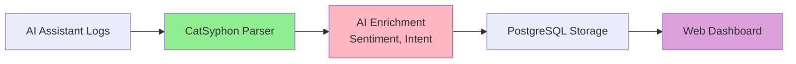
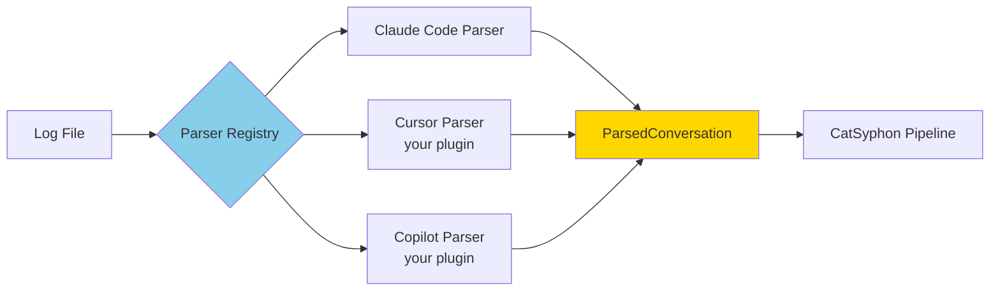
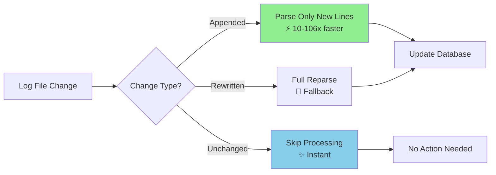

# CatSyphon

<p align="center">
  <strong>AI Coding Assistant Analytics Platform</strong>
</p>

<p align="center">
  Parse, analyze, and gain insights from AI coding assistant conversations<br/>
  <em>Claude Code · Cursor · GitHub Copilot · Any agent logs</em>
</p>

---

## Overview

CatSyphon transforms AI coding assistant conversation logs into actionable insights. Whether you're an **engineering manager** tracking team productivity, a **product team** understanding feature adoption, or an **AI researcher** studying agent effectiveness, CatSyphon provides the analytics you need.

### What You Can Do

- 📊 **Track productivity** - Understand session duration, success rates, and developer patterns
- 🔍 **Analyze conversations** - Search and filter through thousands of AI-assisted coding sessions
- 📈 **Monitor trends** - Visualize sentiment, tool usage, and feature development over time
- 🎯 **Optimize workflows** - Identify bottlenecks and successful patterns
- 🤖 **Compare agents** - Evaluate different AI coding assistants (future)

### How It Works



1. **Ingest**: Upload logs or monitor directories automatically
2. **Enrich**: AI-powered tagging adds sentiment, intent, and outcomes
3. **Analyze**: Explore data through interactive dashboards and charts
4. **Optimize**: Make data-driven decisions about your development workflow

## Features

### Core Capabilities ✅

#### 📝 Multi-Agent Log Parsing
- **Claude Code** support out-of-the-box
- **Extensible plugin architecture** for custom parsers
- **Auto-detection** of log formats
- See [Parser Plugins](#parser-plugins) for adding new agents

#### ⚡ Blazing Fast Incremental Parsing
- **10x to 106x faster** than full reparse
- **45x to 465x less memory** usage
- Automatically handles file appends during live sessions
- Graceful fallback to full parse when needed

#### 👀 Live Directory Watching
- **Real-time monitoring** of log directories
- **Automatic ingestion** of new files
- **Hash-based deduplication** prevents reprocessing
- Daemon runs in background with process management

#### 🤖 AI-Powered Enrichment
- **Sentiment analysis** (positive, neutral, negative, frustrated)
- **Intent classification** (feature_add, bug_fix, refactor, etc.)
- **Outcome detection** (success, partial, failed, abandoned)
- **30-day cache** reduces costs by 80-90%
- Powered by OpenAI GPT-4o-mini

#### 📊 Interactive Web Dashboard
- **Project-level analytics** with sentiment timelines
- **Session filtering** by developer, outcome, date range
- **Tool usage charts** and file modification tracking
- **Real-time updates** with 15-second polling
- **Responsive design** with shadcn/ui components

#### 🗄️ Production-Ready Storage
- **PostgreSQL 15+** with optimized indexes
- **Multi-tenancy support** (workspace isolation)
- **Normalized schema** for efficient queries
- **JSONB metadata** for extensible tagging

#### 🔌 REST API
- **FastAPI** with async SQLAlchemy
- **OpenAPI/Swagger** documentation
- **Pagination** and advanced filtering
- **Type-safe** with Pydantic models

### Coming Soon 🚀

- 📊 **System-wide analytics** - Cross-project trends and executive dashboards
- 🎯 **Agent comparison** - Compare effectiveness across different AI assistants
- 🔍 **Semantic search** - Natural language queries across conversations
- 📋 **Custom templates** - Pre-built and custom query templates
- 🔔 **Alert system** - Automated pattern detection and notifications

## Parser Plugins

CatSyphon uses a **plugin architecture** to support multiple AI coding assistants. Add support for any agent by creating a parser plugin.

### How Parser Plugins Work



### Supported Agents

| Agent | Status | Parser |
|-------|--------|--------|
| **Claude Code** | ✅ Built-in | `ClaudeCodeParser` |
| **Cursor** | 🔌 Plugin | Create your own |
| **GitHub Copilot** | 🔌 Plugin | Create your own |
| **Google Gemini** | 🔌 Plugin | Create your own |
| **Custom agents** | 🔌 Plugin | Create your own |

### Creating a Parser (15 Minutes)

```python
# my_cursor_parser.py
from pathlib import Path
from catsyphon.parsers.base import ConversationParser
from catsyphon.models.parsed import ParsedConversation

class CursorParser:
    def can_parse(self, file_path: Path) -> bool:
        """Check if file is a Cursor log"""
        # Your detection logic here
        return True

    def parse(self, file_path: Path) -> ParsedConversation:
        """Parse Cursor log into standard format"""
        # Your parsing logic here
        return ParsedConversation(...)
```

**Install and use:**

```bash
# 1. Copy to plugins directory
mkdir -p ~/.catsyphon/plugins/cursor-parser
cp my_cursor_parser.py ~/.catsyphon/plugins/cursor-parser/

# 2. CatSyphon auto-discovers and uses it!
catsyphon ingest /path/to/cursor/logs --project "My Project"
```

### Distribution

Package and distribute your parser:

```toml
# pyproject.toml
[project.entry-points."catsyphon.parsers"]
cursor-parser = "my_cursor_parser:CursorParser"
```

```bash
# Users install with pip
pip install your-cursor-parser

# CatSyphon automatically discovers it
catsyphon ingest /path/to/logs
```

### Plugin Documentation

- **📚 [Complete Plugin SDK](./docs/plugin-sdk.md)** - Full guide with examples
- **⚡ [15-Minute Quickstart](./docs/parser-quickstart.md)** - Get started fast
- **🔧 [API Reference](./docs/api-reference.md)** - Technical specifications
- **🏗️ [Architecture](./ARCHITECTURE.md#parser-plugin-system)** - How plugins work

### Plugin Discovery Locations

CatSyphon searches for plugins in this order:

1. **Built-in parsers** (`catsyphon.parsers`)
2. **Entry points** (pip-installed packages) - ⭐ Recommended for distribution
3. **Local directories**:
   - `~/.catsyphon/plugins/` - User plugins
   - `./.catsyphon/parsers/` - Project-specific plugins

## Tech Stack

### Backend
- **Python 3.11+** - Modern async/await support
- **FastAPI** - High-performance REST API framework
- **PostgreSQL 15+** - Primary database with JSONB support
- **SQLAlchemy 2.0** - Async ORM with type safety
- **Alembic** - Database schema migrations
- **OpenAI GPT-4o-mini** - AI-powered metadata enrichment
- **Typer + Rich** - Beautiful CLI interface
- **uv** - Fast Python package installer

### Frontend
- **React 19** with **TypeScript 5.9**
- **Vite 7** - Lightning-fast build tooling
- **shadcn/ui** - Beautiful, accessible components
- **Tailwind CSS 4** - Utility-first styling
- **Recharts** - Composable charting library
- **TanStack Query 5** - Powerful data fetching and caching
- **React Router 7** - Client-side routing
- **pnpm** - Fast, disk-efficient package manager

### Infrastructure
- **Docker + Docker Compose** - Local PostgreSQL
- **pytest** - Python testing framework
- **Vitest** - Modern JavaScript testing
- **Black + Ruff** - Python code formatting and linting
- **ESLint** - JavaScript linting
- **MyPy** - Static type checking

## Prerequisites

Before you begin, ensure you have:

- **Python 3.11+** ([Download](https://www.python.org/downloads/))
- **Node.js 20 LTS** ([Download](https://nodejs.org/))
- **Docker Desktop** ([Download](https://www.docker.com/products/docker-desktop/))
- **[mise](https://mise.jdx.dev/)** (recommended) - Manages all tool versions automatically

Check your versions:

```bash
python --version    # Should be 3.11+
node --version      # Should be 20.x
docker --version    # Any recent version
```

## Quick Start

Get CatSyphon running in **5 minutes**!

### Step 1: Clone and Configure

```bash
# Clone the repository
git clone https://github.com/YOUR_ORG/catsyphon.git
cd catsyphon

# Install dependencies (Python 3.11+, Node 20, pnpm)
mise install

# Configure environment
cp .env.example .env
nano .env  # Add your OpenAI API key (required for AI tagging)
```

**Required environment variables:**
```bash
# .env
OPENAI_API_KEY=sk-your-key-here     # Get from https://platform.openai.com/api-keys
POSTGRES_PASSWORD=catsyphon_dev_password
```

### Step 2: Start PostgreSQL

```bash
# Start PostgreSQL in Docker
docker-compose up -d

# Verify it's running
docker-compose ps
```

Expected output:
```
NAME                  IMAGE              STATUS
catsyphon-postgres    postgres:15-alpine Up 5 seconds
```

### Step 3: Setup Backend

```bash
cd backend

# Install Python dependencies
uv sync --all-extras

# Run database migrations
uv run alembic upgrade head

# Verify setup
uv run python -c "from catsyphon.api.app import app; print('✓ Backend ready')"
```

### Step 4: Start the Application

**Option A: Full Stack (Backend + Frontend)**

```bash
# Terminal 1: Start backend API
cd backend
uv run catsyphon serve

# Terminal 2: Start frontend dev server
cd frontend
pnpm install
pnpm dev
```

Then open **http://localhost:5173** in your browser!

**Option B: Backend Only (API + CLI)**

```bash
cd backend
uv run catsyphon serve
```

Then open **http://localhost:8000/docs** for the API documentation.

### Step 5: Ingest Your First Logs

**Via Web UI:**
1. Open http://localhost:5173
2. Navigate to "Ingestion" → "Upload Files"
3. Drag and drop your Claude Code logs
4. Click "Upload and Process"

**Via CLI:**
```bash
cd backend

# One-time batch ingestion
uv run catsyphon ingest ~/path/to/claude-code/logs --project "My Project"

# With AI tagging (costs ~$10 per 1,000 conversations)
uv run catsyphon ingest ~/path/to/logs --project "My Project" --enable-tagging

# Setup live directory watching
# Use the Web UI → Ingestion → Watch Directories
```

### What's Next?

- 📊 **View Analytics** - Navigate to Projects → [Your Project] to see insights
- 🔍 **Explore Conversations** - Browse and search through your AI-assisted sessions
- 📈 **Check Trends** - View sentiment timelines and tool usage charts
- ⚙️ **Configure Watching** - Set up automatic ingestion for live monitoring

---

### Troubleshooting

**PostgreSQL connection failed:**
```bash
# Check if PostgreSQL is running
docker-compose ps

# View logs
docker-compose logs postgres

# Restart PostgreSQL
docker-compose down && docker-compose up -d
```

**Import errors:**
```bash
# Ensure you're in the virtual environment
cd backend
uv sync --all-extras
```

**OpenAI API errors:**
```bash
# Verify API key is set
echo $OPENAI_API_KEY

# Test tagging
cd backend
uv run python -c "import openai; print('✓ OpenAI client ok')"
```

## Performance

CatSyphon's **incremental parsing** provides massive performance gains for live sessions and watched directories.

### Benchmarks

| Scenario | Speedup | Memory Reduction |
|----------|---------|------------------|
| Small append (1→100 messages) | **9.9x faster** | **45x less** |
| Medium log (10→1000 messages) | **36.6x faster** | **45x less** |
| Large log (1→5000 messages) | **106x faster** | **465x less** |
| Multiple sequential appends | **14x faster** | N/A |



### How It Works

1. **First parse**: Stores parsing state (byte offset, line number, content hash)
2. **Subsequent parses**: Detects change type (APPEND, UNCHANGED, REWRITE, TRUNCATE)
3. **Smart processing**:
   - ⚡ **APPEND**: Parse only new content from last offset
   - ✨ **UNCHANGED**: Skip processing entirely
   - 📝 **REWRITE/TRUNCATE**: Full reparse as fallback
4. **Automatic**: Used by watch daemon, CLI, and API - zero configuration!

**Run benchmarks:**
```bash
cd backend
uv run pytest tests/test_performance.py -v -s -m benchmark
```

For implementation details, see [Incremental Parsing Guide](./docs/incremental-parsing.md)

## Project Structure

```
catsyphon/                      # Monorepo root
├── backend/                    # Python backend (FastAPI)
│   ├── src/catsyphon/          # Main package
│   │   ├── api/                # REST API routes
│   │   │   ├── app.py          # FastAPI application
│   │   │   └── routes/         # Endpoint handlers
│   │   │       ├── conversations.py
│   │   │       ├── projects.py    # Epic 7 analytics
│   │   │       ├── stats.py
│   │   │       ├── upload.py
│   │   │       └── watch.py
│   │   │
│   │   ├── parsers/            # Plugin-based log parsers
│   │   │   ├── base.py         # Parser protocol
│   │   │   ├── registry.py     # Auto-detection
│   │   │   ├── claude_code.py  # Built-in Claude Code parser
│   │   │   ├── incremental.py  # Incremental parsing logic
│   │   │   └── metadata.py     # Parser metadata
│   │   │
│   │   ├── pipeline/           # Ingestion & processing
│   │   │   └── ingestion.py    # ETL pipeline
│   │   │
│   │   ├── db/                 # Database layer
│   │   │   ├── connection.py   # Session management
│   │   │   ├── migrations/     # Alembic migrations
│   │   │   └── repositories/   # Data access layer
│   │   │
│   │   ├── models/             # Data models
│   │   │   ├── db.py           # SQLAlchemy ORM models
│   │   │   └── parsed.py       # Pydantic schemas
│   │   │
│   │   ├── tagging/            # AI enrichment
│   │   │   ├── engine.py       # OpenAI integration
│   │   │   └── cache.py        # File-based cache
│   │   │
│   │   ├── watch.py            # Directory monitoring daemon
│   │   ├── cli.py              # Typer CLI commands
│   │   └── config.py           # Configuration (Pydantic Settings)
│   │
│   ├── tests/                  # Pytest test suite
│   │   ├── test_parsers/       # Parser unit tests
│   │   ├── test_api_*.py       # API endpoint tests
│   │   ├── test_pipeline.py    # Integration tests
│   │   └── test_performance.py # Benchmark tests
│   │
│   └── pyproject.toml          # Python dependencies (uv)
│
├── frontend/                   # React frontend (Vite + TypeScript)
│   └── src/
│       ├── pages/              # Page components
│       │   ├── Dashboard.tsx         # System overview
│       │   ├── ProjectList.tsx       # All projects
│       │   ├── ProjectDetail.tsx     # Epic 7: Analytics
│       │   ├── ConversationList.tsx  # Search & filter
│       │   ├── ConversationDetail.tsx
│       │   ├── Ingestion.tsx         # Upload & watch
│       │   └── Setup.tsx             # Onboarding
│       │
│       ├── components/         # Shared UI components
│       ├── lib/                # Utilities
│       │   ├── api.ts          # Type-safe API client
│       │   └── queryClient.ts  # TanStack Query setup
│       │
│       └── types/              # TypeScript interfaces
│
├── docs/                       # Technical documentation
│   ├── ARCHITECTURE.md         # 🆕 System architecture (diagrams)
│   ├── implementation-plan.md  # Detailed specs
│   ├── incremental-parsing.md  # Performance guide
│   ├── plugin-sdk.md           # Parser plugin guide
│   ├── parser-quickstart.md    # 15-min tutorial
│   └── api-reference.md        # API docs
│
├── .mise.toml                  # Tool version management
├── docker-compose.yml          # PostgreSQL container
├── .env.example                # Environment template
└── CLAUDE.md                   # AI agent instructions
```

**Key directories:**

- 🔌 **parsers/** - Add new parsers here (plugin system)
- 🌐 **api/routes/** - REST API endpoints
- 📊 **frontend/src/pages/** - UI pages and components
- 📚 **docs/** - Technical documentation with diagrams
- 🧪 **tests/** - 1,200+ passing tests

## Development

### Backend Development

```bash
cd backend

# Run tests
uv run pytest

# Run tests with coverage
uv run pytest --cov=src/catsyphon --cov-report=html

# Type checking
uv run mypy src/

# Format code
uv run black src/ tests/

# Lint
uv run ruff check src/ tests/

# Create database migration
uv run alembic revision --autogenerate -m "Description"

# Apply migrations
uv run alembic upgrade head
```

### Frontend Development (Phase 2)

```bash
cd frontend

# Install dependencies
pnpm install

# Development server
pnpm dev

# Build for production
pnpm build

# Type check
pnpm tsc --noEmit
```

### Database Management

```bash
# Start PostgreSQL
docker-compose up -d

# Stop PostgreSQL
docker-compose down

# View logs
docker-compose logs -f postgres

# Access PostgreSQL CLI
docker exec -it catsyphon-postgres psql -U catsyphon -d catsyphon

# Reset database (WARNING: deletes all data)
docker-compose down -v
docker-compose up -d
cd backend && uv run alembic upgrade head
```

## Issue Tracking

This project uses [bd (beads)](https://github.com/steveyegge/beads) for issue tracking.

```bash
# Check ready work
bd ready

# Create new issue
bd create "Issue title" -t bug|feature|task -p 0-4

# Update issue status
bd update <issue-id> --status in_progress

# Close issue
bd close <issue-id> --reason "Completed"
```

See [AGENTS.md](./AGENTS.md) for detailed workflow.

## Environment Variables

See [.env.example](./.env.example) for all available configuration options.

Key variables:
- `OPENAI_API_KEY` - Your OpenAI API key (required for tagging)
- `DATABASE_URL` - PostgreSQL connection string
- `ENVIRONMENT` - `development` or `production`
- `LOG_LEVEL` - Logging level (DEBUG, INFO, WARNING, ERROR)

## Cost Estimates

Using OpenAI gpt-4o-mini for tagging:
- **~$10 per 1,000 conversations**
- **~$10-15/month** for a team of 10 developers

See [docs/implementation-plan.md](./docs/implementation-plan.md) for detailed cost breakdown.

## Documentation

### 📚 For Users

- **[README.md](./README.md)** (this file) - Quick start and overview
- **[🏗️ ARCHITECTURE.md](./ARCHITECTURE.md)** - System architecture with diagrams
- **[⚡ Incremental Parsing](./docs/incremental-parsing.md)** - Performance optimization guide

### 🔌 For Plugin Developers

- **[Parser Plugin SDK](./docs/plugin-sdk.md)** - Complete guide to creating parsers
- **[15-Minute Quickstart](./docs/parser-quickstart.md)** - Build your first parser
- **[API Reference](./docs/api-reference.md)** - Parser API specifications

### 🛠️ For Contributors

- **[Implementation Plan](./docs/implementation-plan.md)** - Detailed technical specs
- **[AGENTS.md](./AGENTS.md)** - Issue tracking workflow (bd/beads)
- **[CLAUDE.md](./CLAUDE.md)** - AI agent development instructions

## Contributing

We welcome contributions! Here's how to get started:

### 1. Find or Create a Task

```bash
# View ready work
bd ready

# Create new issue
bd create "Add Cursor parser support" -t feature -p 2

# Claim a task
bd update catsyphon-42 --status in_progress
```

### 2. Development Workflow

```bash
# Create feature branch
git checkout -b feature/cursor-parser

# Make changes and test
cd backend
uv run pytest

# Format and lint
uv run black src/ tests/
uv run ruff check --fix src/ tests/

# Commit (include .beads/issues.jsonl)
git add .
git commit -m "feat: add Cursor log parser"

# Mark task complete
bd close catsyphon-42 --reason "Completed"
```

### 3. Code Quality Standards

- ✅ **All tests passing** (pytest + vitest)
- ✅ **Type checking** (mypy + TypeScript)
- ✅ **Formatting** (Black + ESLint)
- ✅ **Linting** (Ruff + ESLint)
- ✅ **Documentation** updated

### 4. Pull Request Guidelines

- Clear description of changes
- Link to related issues (bd-xxx)
- Add tests for new features
- Update documentation if needed
- Ensure CI passes

See [AGENTS.md](./AGENTS.md) for detailed workflow and conventions.

## FAQ

<details>
<summary><strong>Q: Can I use CatSyphon without OpenAI?</strong></summary>

Yes! AI tagging is **optional**. Without it, you still get:
- All conversation data (messages, files, timestamps)
- Basic statistics and filtering
- Full web UI access

AI tagging adds sentiment, intent, and outcome classification.
</details>

<details>
<summary><strong>Q: How much does AI tagging cost?</strong></summary>

Using OpenAI GPT-4o-mini:
- **~$10 per 1,000 conversations** (first ingestion)
- **~$1-2 per 1,000 conversations** (with 30-day cache)
- **~$10-15/month** for a team of 10 developers

The file cache reduces costs by 80-90%.
</details>

<details>
<summary><strong>Q: What AI assistants are supported?</strong></summary>

**Built-in:**
- Claude Code (fully tested)

**Via plugins:**
- Any AI coding assistant with parseable logs
- See [Parser Plugin SDK](./docs/plugin-sdk.md) to add support
</details>

<details>
<summary><strong>Q: Can I deploy CatSyphon to production?</strong></summary>

Yes! CatSyphon is production-ready:
- ✅ 1,200+ passing tests
- ✅ 84% backend coverage
- ✅ PostgreSQL with optimized indexes
- ✅ Multi-tenancy support (workspace isolation)

See [ARCHITECTURE.md](./ARCHITECTURE.md#deployment-architecture-future) for deployment patterns.
</details>

<details>
<summary><strong>Q: Is my data private?</strong></summary>

Yes:
- All data stored locally in your PostgreSQL database
- OpenAI API only receives conversation metadata (not full code)
- Self-hosted deployment (no external analytics)
- Open source (audit the code)
</details>

## Roadmap

- [ ] **v0.3** - Multi-agent comparison dashboard
- [ ] **v0.4** - Semantic search across conversations
- [ ] **v0.5** - Custom query templates
- [ ] **v0.6** - Alert system for pattern detection
- [ ] **v1.0** - Production deployment guides + authentication

See [GitHub Issues](https://github.com/YOUR_ORG/catsyphon/issues) for detailed roadmap.

## License

MIT License - see [LICENSE](./LICENSE) for details

## Support & Community

- 🐛 **Report bugs**: `bd create "Bug description" -t bug`
- 💡 **Request features**: `bd create "Feature idea" -t feature`
- 📖 **Documentation**: See [docs/](./docs/)
- 💬 **Discussions**: GitHub Discussions (coming soon)

---

<p align="center">
  <strong>Built with ❤️ for understanding human-AI collaboration</strong><br/>
  <sub>Transform your AI coding assistant logs into actionable insights</sub>
</p>
