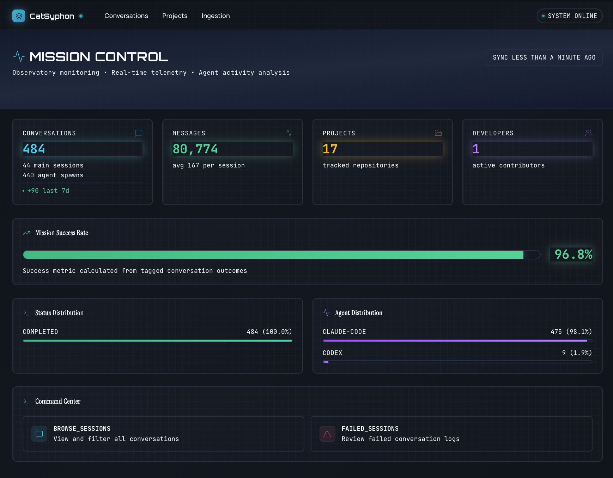
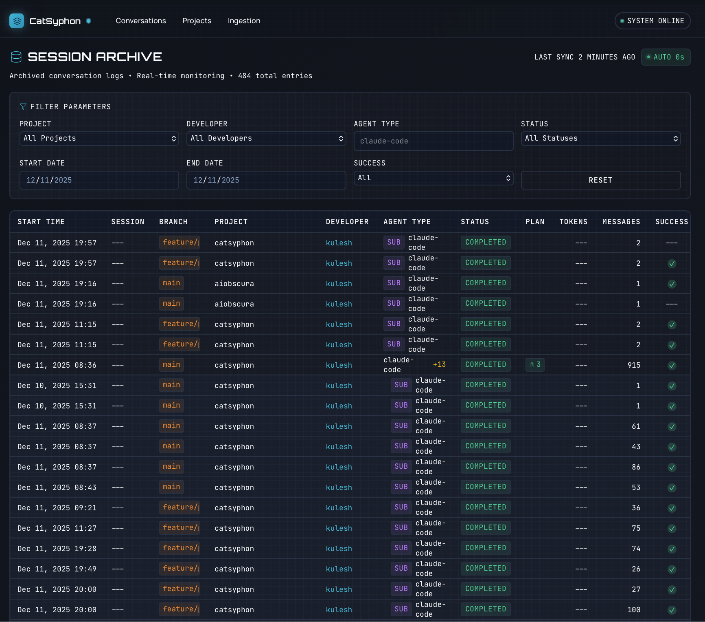
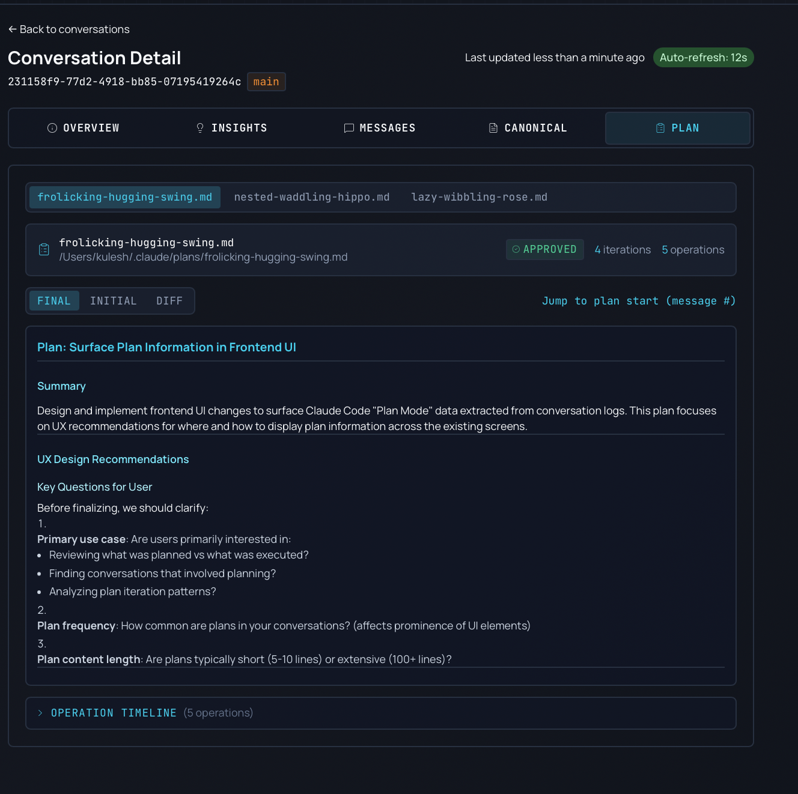
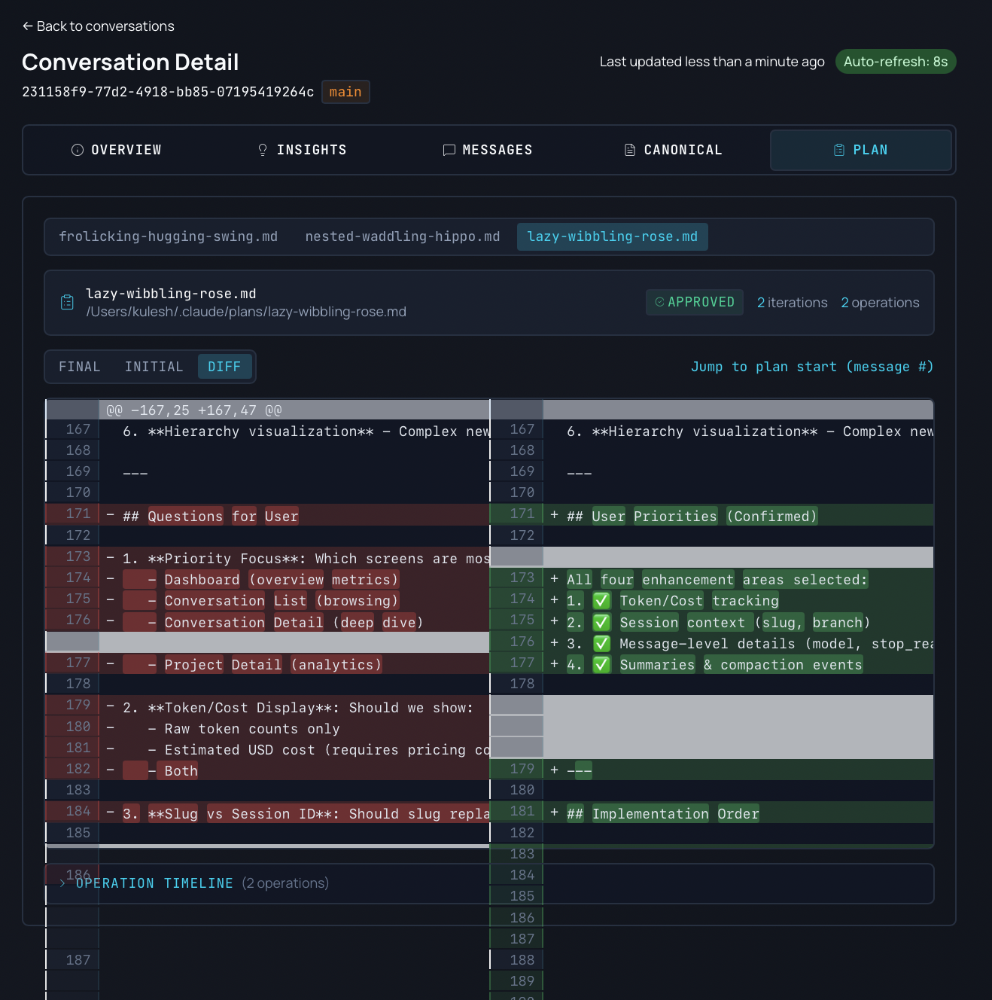

# CatSyphon

Analyze your AI coding assistant conversations. Track what works, find patterns, improve your workflow.



---

## Quick Start

```bash
# Clone and setup
git clone https://github.com/kulesh/catsyphon.git && cd catsyphon
cp .env.example .env

# Start everything
docker-compose up -d
cd backend && uv sync --all-extras && uv run alembic upgrade head
uv run catsyphon serve &
cd ../frontend && pnpm install && pnpm dev
```

Open **http://localhost:5173** and start ingesting your Claude Code logs.

**Where are my logs?** `~/.claude/projects/` contains your Claude Code conversation history.

> **Prerequisites**: Python 3.11+, Node 20+, Docker, [uv](https://github.com/astral-sh/uv), [pnpm](https://pnpm.io/)
>
> Use [mise](https://mise.jdx.dev/) to install tools automatically: `mise install`
>
> **Optional**: Add `OPENAI_API_KEY` to `.env` for AI-powered tagging.

---

## What You Get

### Browse All Your Projects
See sessions, activity, and navigate to detailed analytics.


### Session Archive
Search and filter through all your AI-assisted coding sessions. See session names, git branches, token usage, and plan indicators at a glance.



### Automatic Ingestion
Point at your log directories and watch them auto-import. Supports live sessions.


### Plan Mode Tracking
See Claude's planning process - view plans, track iterations, and compare changes between versions with diff view.





### AI Collaboration Health
Get an effectiveness score based on success rates, session patterns, and outcomes.


### Detailed Recommendations
See what's working, what's not, and actionable recommendations.


### Sentiment & Tool Analytics
Track sentiment over time, see which tools are used most, identify top problems.


### AI-Powered Insights
Collaboration quality, agent effectiveness, and scope clarity scores with weekly trends.


### Workflow Patterns
Discover your workflow patterns, learning opportunities, and anti-patterns.


### File Modification Tracking
See which files changed most, lines added/deleted across all sessions.


---

## Supported Agents

| Agent | Status |
|-------|--------|
| Claude Code | Built-in |
| OpenAI Codex | Built-in |
| Others | [Plugin SDK](docs/plugin-sdk.md) |

---

## Tech Stack

**Backend**: Python 3.11, FastAPI, PostgreSQL, SQLAlchemy, OpenAI
**Frontend**: React 19, TypeScript, Vite, Tailwind, shadcn/ui

---

## Development

```bash
# Backend
cd backend
uv run pytest                    # Tests
uv run mypy src/                 # Type check
uv run black src/ tests/         # Format

# Frontend
cd frontend
pnpm dev                         # Dev server
pnpm test                        # Tests
pnpm tsc --noEmit               # Type check
```

---

## Documentation

- [Architecture](ARCHITECTURE.md) - System design and diagrams
- [Plugin SDK](docs/plugin-sdk.md) - Add support for other agents
- [API Reference](docs/api-reference.md) - REST API docs
- [Contributing](AGENTS.md) - Issue tracking with bd/beads

---

## License

MIT
