# CatSyphon Architecture

This document provides a comprehensive technical overview of CatSyphon's architecture, data flow, and key design decisions.

## Table of Contents

- [System Overview](#system-overview)
- [High-Level Architecture](#high-level-architecture)
- [Data Flow](#data-flow)
- [Parser Plugin System](#parser-plugin-system)
- [Database Schema](#database-schema)
- [Incremental Parsing](#incremental-parsing)
- [Canonicalization System](#canonicalization-system)
- [Insights System](#insights-system)
- [Frontend Architecture](#frontend-architecture)
- [API Design](#api-design)
- [Key Design Decisions](#key-design-decisions)

## System Overview

CatSyphon is a full-stack application for analyzing AI coding assistant conversation logs. It provides:

- **Log ingestion** from multiple AI coding assistants (Claude Code, Cursor, Copilot, etc.)
- **AI-powered enrichment** using OpenAI GPT-4o-mini for sentiment, intent, and outcome analysis
- **Canonicalization** with intelligent message sampling and LLM-optimized narrative generation
- **60+ insights** across session success, developer experience, tool usage, and code productivity
- **Real-time monitoring** with live directory watching and automatic file deduplication
- **Advanced analytics** through a modern web interface with dashboards and visualizations
- **REST API** for programmatic access to conversation data

**Test Coverage**: 1,345+ tests (1,062 backend with 84% coverage, 283 frontend)

## High-Level Architecture

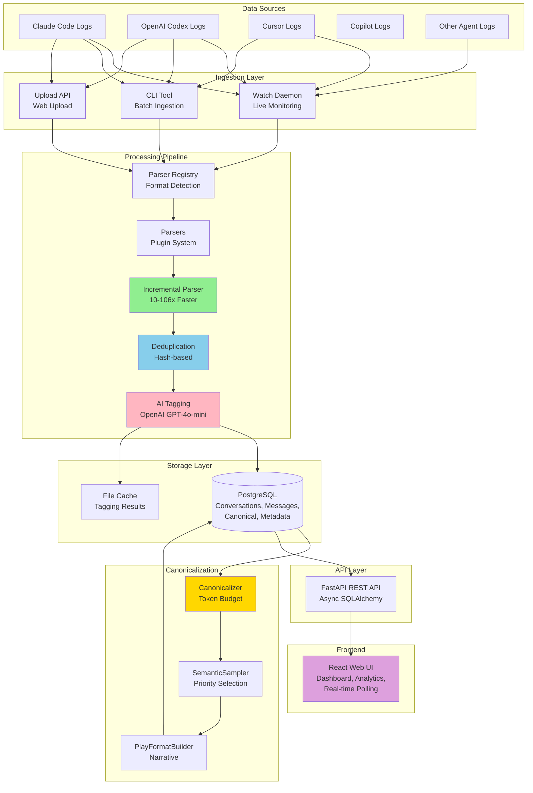

### Key Components

| Layer | Component | Purpose |
|-------|-----------|---------|
| **Ingestion** | Watch Daemon | Monitors directories for new logs |
| | CLI Tool | Batch processing of log files |
| | Upload API | Web-based file uploads |
| **Processing** | Parser Registry | Auto-detects log format |
| | Plugin Parsers | Extensible parser implementations |
| | Incremental Parser | Optimized for appends (10-106x faster) |
| | Deduplication | Hash-based duplicate prevention |
| | AI Tagging | Sentiment, intent, outcome enrichment |
| **Canonicalization** | Canonicalizer | Token budget management |
| | SemanticSampler | Priority-based message selection |
| | PlayFormatBuilder | LLM-optimized narrative generation |
| **Storage** | PostgreSQL | Normalized schema with JSONB |
| | File Cache | 30-day TTL for tagging results |
| **API** | FastAPI | Async REST API |
| | SQLAlchemy 2.0 | Async ORM with repository pattern |
| **Frontend** | React 19 | Real-time polling, interactive charts |

## Data Flow

### Complete Ingestion Flow

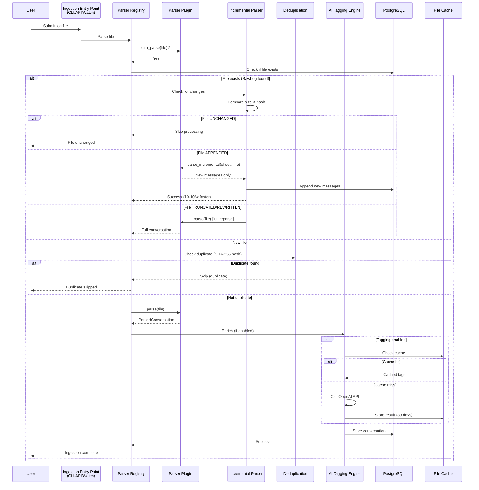

### Watch Daemon Flow

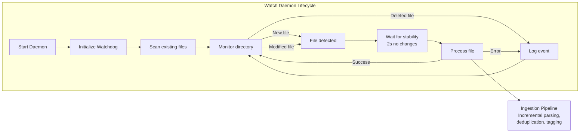

## Parser Plugin System

### Parser Discovery and Registration

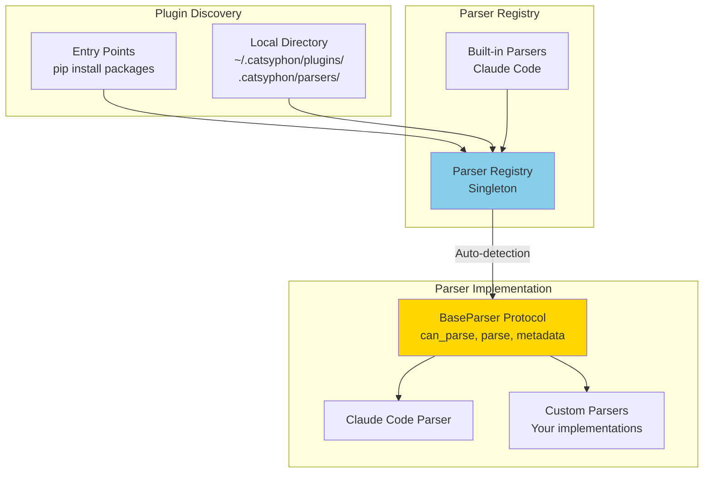

### Parser Interface

Every parser must implement the `ConversationParser` protocol:

```python
class ConversationParser(Protocol):
    @property
    def metadata(self) -> ParserMetadata:
        """Parser name, version, capabilities"""
        ...

    def can_parse(self, file_path: Path) -> bool:
        """Fast format detection (check first few lines)"""
        ...

    def parse(self, file_path: Path) -> ParsedConversation:
        """Parse entire file into structured format"""
        ...
```

For incremental parsing support, implement `IncrementalParser`:

```python
class IncrementalParser(Protocol):
    def parse_incremental(
        self,
        file_path: Path,
        last_offset: int,
        last_line: int
    ) -> ParsedConversation:
        """Parse only new content from offset"""
        ...
```

### Parser Priority

Parsers are tried in registration order:

1. **Built-in parsers** (Claude Code)
2. **Entry point parsers** (pip installed)
3. **Local directory parsers** (development)

The **first parser** where `can_parse()` returns `True` is selected.

## Database Schema

### Entity Relationship Diagram

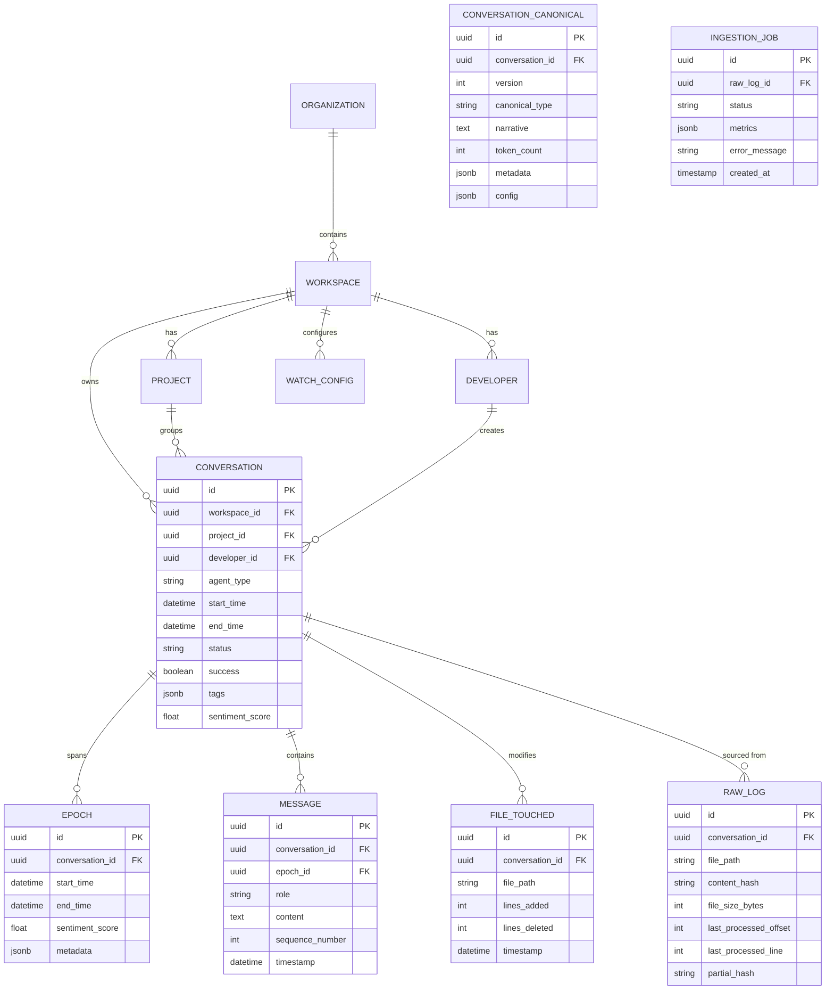

### Key Tables

#### Core Entities
- **organizations**: Multi-workspace companies
- **workspaces**: Data isolation boundary (multi-tenancy)
- **projects**: Code projects/repositories
- **developers**: Users creating conversations

#### Conversation Data
- **conversations**: Main conversation/session entity
- **epochs**: Time segments within conversations (for sentiment tracking)
- **messages**: Individual messages (user/assistant turns)
- **files_touched**: File modifications tracked in conversation
- **raw_logs**: Source file metadata and incremental parsing state

#### Configuration
- **watch_configurations**: Directory monitoring settings
- **collector_configs**: Remote collector agent settings (future)

#### Canonicalization & Processing
- **conversation_canonical**: Cached LLM-optimized representations
- **ingestion_jobs**: Processing status and metrics tracking

### Indexes

Optimized for common query patterns:

```sql
-- Conversation queries
CREATE INDEX idx_conv_workspace ON conversations(workspace_id);
CREATE INDEX idx_conv_project ON conversations(project_id);
CREATE INDEX idx_conv_developer ON conversations(developer_id);
CREATE INDEX idx_conv_start_time ON conversations(start_time);
CREATE INDEX idx_conv_agent_type ON conversations(agent_type);

-- Message queries
CREATE INDEX idx_msg_conversation ON messages(conversation_id);
CREATE INDEX idx_msg_epoch ON messages(epoch_id);
CREATE INDEX idx_msg_sequence ON messages(conversation_id, sequence_number);

-- File tracking
CREATE INDEX idx_file_conversation ON files_touched(conversation_id);
CREATE INDEX idx_file_path ON files_touched(file_path);

-- Deduplication
CREATE INDEX idx_rawlog_hash ON raw_logs(content_hash);
CREATE UNIQUE INDEX idx_rawlog_path ON raw_logs(file_path);
```

## Incremental Parsing

### Performance Improvement

Incremental parsing provides dramatic performance improvements for files being actively appended:

| Scenario | Speedup | Memory Reduction |
|----------|---------|------------------|
| Small append (1→100 messages) | **9.9x faster** | 45x less |
| Medium log (10→1000 messages) | **36.6x faster** | 45x less |
| Large log (1→5000 messages) | **106x faster** | 465x less |
| Multiple sequential appends | **14x faster** | N/A |

### Change Detection Algorithm

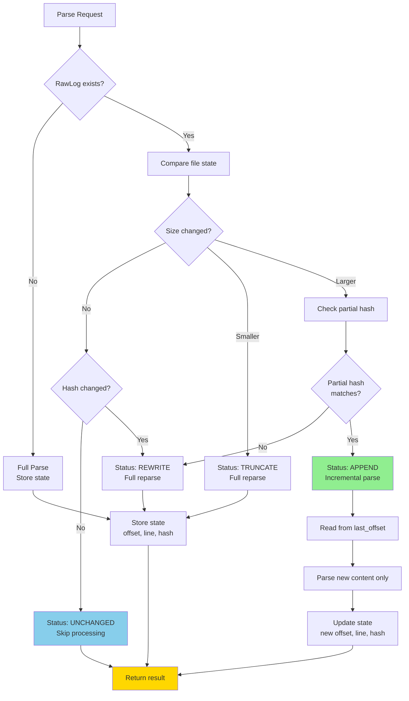

### State Tracking

The `raw_logs` table stores parsing state:

```python
class RawLog(Base):
    file_path: str                    # Absolute path to source file
    content_hash: str                 # SHA-256 hash of entire file
    file_size_bytes: int             # File size in bytes
    last_processed_offset: int       # Byte offset of last parsed position
    last_processed_line: int         # Line number of last parsed message
    partial_hash: str                # Hash of first 64KB (for append detection)
```

### Incremental Parsing Flow

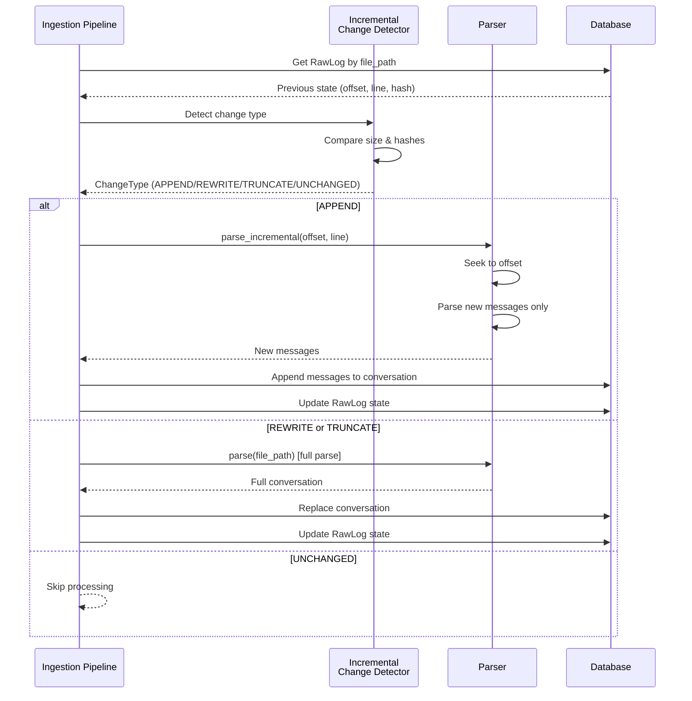

## Canonicalization System

The canonicalization system converts raw conversation logs into optimized, hierarchical narrative representations for efficient LLM analysis.

### Key Benefits

| Benefit | Improvement |
|---------|-------------|
| Tagging Latency | 50%+ reduction |
| Token Efficiency | 90%+ fit within 10K budget |
| API Cost Reduction | 80-90% fewer OpenAI calls |
| Context Quality | Hierarchical agent context |

### Canonicalization Flow

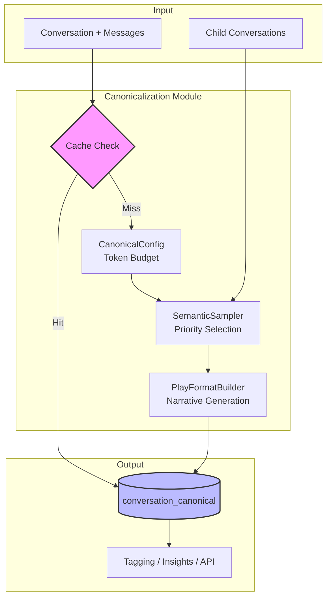

### Canonical Types

| Type | Token Budget | Use Case |
|------|-------------|----------|
| **TAGGING** | 8K | Quick metadata extraction |
| **INSIGHTS** | 12K | Analytics and patterns |
| **EXPORT** | 20K | Full representation |

### Sampling Strategies

| Strategy | Budget | Best For |
|----------|--------|----------|
| **semantic** | Enforced | Most use cases (priority-based) |
| **epoch** | Enforced | Workflow analysis (full first/last epochs) |
| **chronological** | Unlimited | Large context models, exports |

### Message Priority

```python
Priority Levels:
- 1000: First/last messages (always included)
- 900:  Error messages
- 800:  Tool calls
- 700:  Thinking content
- 600:  Epoch boundaries
- 500:  Code changes
```

### Play Format Narrative

The builder generates a theatrical "play" format optimized for LLM comprehension:

```
=== CONVERSATION: claude-code-2024-11-21-14-30-00 ===
Agent: claude-code v1.2.5
Type: main
Duration: 17 minutes 32 seconds
Status: COMPLETED (SUCCESS)
Messages: 42 | Epochs: 3 | Files: 5

--- EPOCH 1 ---

[14:30:15] USER: Help me implement JWT authentication
  [PRIORITY: first]

[14:30:30] ASSISTANT: I'll help you add JWT authentication...
  [TOOLS: Glob, Read]
    ✓ Read: /app/models/user.py

┌─ AGENT DELEGATION: child-session-id ─┐
│ Type: agent
│ Tools: Read, Edit
│   [14:37:05] AGENT: Analyzing...
└────────────────────────────────────────┘

=== SUMMARY ===
Outcome: SUCCESS
Intent: feature_add
Sampling: 18/42 messages (43%)
```

For full details, see [Canonicalization Architecture](./docs/canonicalization-architecture.md).

---

## Insights System

CatSyphon extracts 60+ insights from conversation logs to measure agent-human collaboration effectiveness.

### Insight Categories

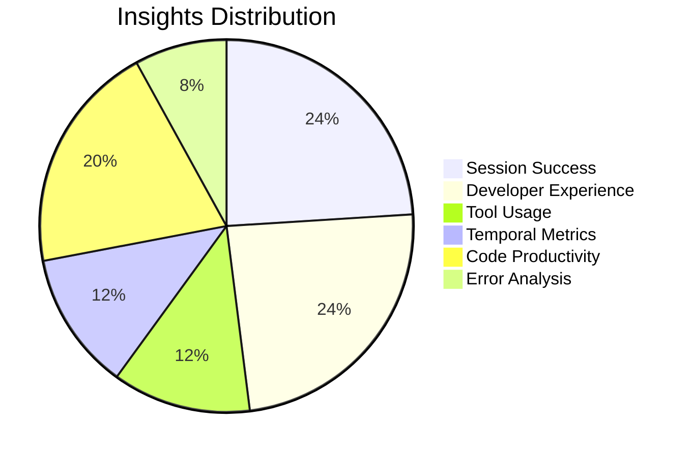

| Category | Insights | Key Metrics |
|----------|----------|-------------|
| **Session Success** | 18 | Success rate by project, developer, intent |
| **Developer Experience** | 18 | Sentiment trends, frustration detection |
| **Tool Usage** | 9 | Agent behavior, tool effectiveness |
| **Temporal Metrics** | 9 | Duration analysis, time patterns |
| **Code Productivity** | 15 | Lines changed, files touched |
| **Error Analysis** | 6 | Problem patterns, resolution rates |

### Example Insights

**Success Rate by Context:**
- Overall success rate: `SUM(success=True) / COUNT(*)`
- Success by project: Identify difficult codebases
- Success by developer: Find learning opportunities
- Success by intent: Compare task type effectiveness

**Intent vs. Outcome Analysis:**
- Success rate by intent type
- Average duration by intent
- Intent-outcome matrix heatmap
- Sentiment by intent type

**Tool Usage Patterns:**
- Most used tools per project
- Tool call success/failure rates
- Tool call sequences
- Agent delegation frequency

For the complete catalog, see [Insights Comprehensive Analysis](./docs/insights-comprehensive-analysis.md).

---

## Frontend Architecture

### Component Structure

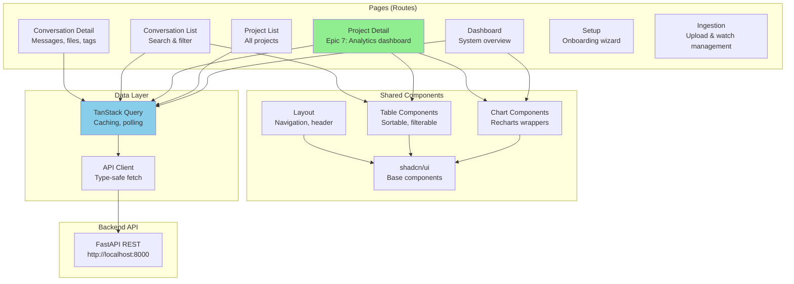

### Real-Time Data Strategy

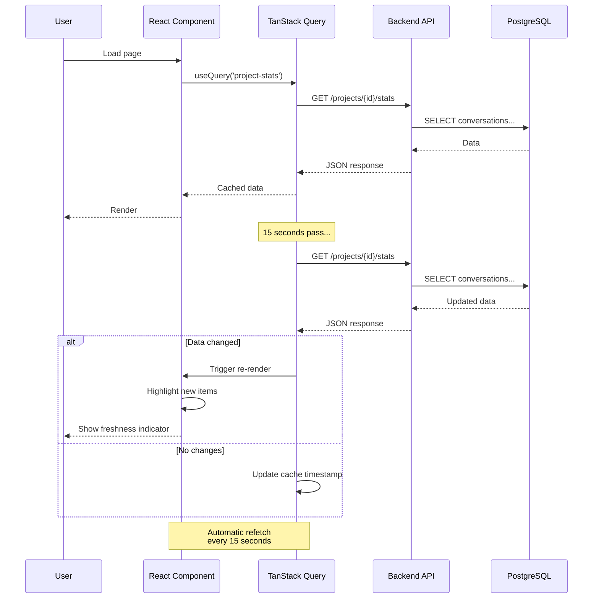

### Key Frontend Features

1. **Auto-refresh polling**: 15-second intervals with TanStack Query
2. **Freshness indicators**: Shows when data was last updated
3. **New item highlighting**: Visual indication of new conversations
4. **Optimistic updates**: Immediate UI feedback for mutations
5. **Smart caching**: Deduplication and background refetching

## API Design

### REST Endpoint Organization

```
/
├── /health                          # Health check
├── /ready                           # Readiness probe
├── /docs                            # Swagger UI
│
├── /setup                           # Onboarding wizard
│   ├── GET  /status                 # Check setup status
│   └── POST /initialize             # Create workspace
│
├── /conversations                   # Conversation queries
│   ├── GET  /                       # List with filters
│   ├── GET  /{id}                   # Get by ID
│   ├── GET  /{id}/messages          # Get messages
│   ├── GET  /{id}/files             # Get file changes
│   ├── GET  /{id}/canonical         # Get canonical representation
│   ├── GET  /{id}/canonical/narrative  # Get narrative only
│   └── POST /{id}/canonical/regenerate # Force regenerate
│
├── /projects                        # Project analytics
│   ├── GET  /                       # List projects
│   ├── GET  /{id}/stats             # Project statistics (Epic 7)
│   ├── GET  /{id}/sessions          # Session list (Epic 7)
│   └── GET  /{id}/files             # File aggregations
│
├── /stats                           # System-wide statistics
│   ├── GET  /overview               # Dashboard metrics
│   ├── GET  /by-project             # Project breakdown
│   └── GET  /by-developer           # Developer patterns
│
├── /metadata                        # Lookup tables
│   ├── GET  /projects               # All projects
│   ├── GET  /developers             # All developers
│   └── GET  /workspaces             # All workspaces
│
├── /upload                          # File upload
│   └── POST /                       # Multipart upload
│
├── /ingestion                       # Ingestion management
│   ├── POST /process                # Process log file
│   ├── GET  /jobs                   # List ingestion jobs
│   ├── GET  /jobs/{id}              # Get job details
│   └── GET  /stats                  # Pipeline performance stats
│
└── /watch                           # Directory watching
    ├── GET    /configs              # List watch configs
    ├── POST   /configs              # Create watch config
    ├── GET    /configs/{id}         # Get watch config
    ├── PUT    /configs/{id}         # Update watch config
    ├── DELETE /configs/{id}         # Delete watch config
    ├── POST   /configs/{id}/start   # Start daemon
    ├── POST   /configs/{id}/stop    # Stop daemon
    └── GET    /configs/{id}/status  # Daemon status
```

### Query Parameters (Epic 7 Features)

**GET /projects/{id}/stats**
- `date_range`: Filter by date (7d, 30d, 90d, all)

**GET /projects/{id}/sessions**
- `page`, `page_size`: Pagination
- `developer`: Filter by developer username
- `outcome`: Filter by success/failed status
- `date_from`, `date_to`: Date range filters
- `sort_by`: Column to sort (start_time, duration, status, developer)
- `order`: Sort order (asc, desc)

### Response Models (Pydantic)

All endpoints return typed Pydantic models:

```python
class ProjectStats(BaseModel):
    project_id: UUID
    session_count: int
    total_messages: int
    total_files_changed: int
    success_rate: Optional[float]
    avg_session_duration_seconds: Optional[float]
    first_session_at: Optional[datetime]
    last_session_at: Optional[datetime]
    top_features: list[str]
    top_problems: list[str]
    tool_usage: dict[str, int]
    developer_count: int
    developers: list[str]
    sentiment_timeline: list[SentimentTimelinePoint]
```

## Key Design Decisions

### 1. Plugin-Based Parser System

**Decision**: Use a registry pattern with auto-detection

**Rationale**:
- Extensibility: Easy to add new agent support
- Separation of concerns: Each parser is independent
- Auto-detection: No manual format specification needed
- Entry points: Standard Python packaging for distribution

**Trade-offs**:
- Slightly slower than hardcoded parsers
- Requires parsers to implement `can_parse()` efficiently

### 2. Incremental Parsing

**Decision**: Store parsing state and only process new content

**Rationale**:
- Massive performance improvements (10-106x faster)
- Essential for live file watching (watch daemon)
- Reduces memory usage by 45-465x
- Graceful degradation to full parse if needed

**Trade-offs**:
- Additional state tracking in database
- Complexity in change detection logic
- Not all parsers may support incremental mode

### 3. Hash-Based Deduplication

**Decision**: Use SHA-256 content hash for duplicate detection

**Rationale**:
- Prevents reprocessing identical files
- Content-based (not path-based)
- Cryptographically secure (collision-resistant)
- Fast computation (modern CPUs optimize SHA-256)

**Trade-offs**:
- Requires hashing entire file
- Storage overhead for hashes
- Can't detect semantic duplicates (only exact matches)

### 4. AI Tagging with File Cache

**Decision**: Use OpenAI GPT-4o-mini with 30-day file cache

**Rationale**:
- Cost reduction: 80-90% savings on repeated ingestions
- Fast: Cache lookups are instant
- Simple: File-based, no database overhead
- TTL: Automatic cleanup of stale entries

**Trade-offs**:
- Cache can become stale if model improves
- File system dependency (not distributed)
- Manual cache invalidation required for updates

### 5. Canonicalization System

**Decision**: Convert conversations to token-budgeted, theatrical narrative format

**Rationale**:
- 50%+ reduction in tagging latency
- 80-90% fewer OpenAI API calls through caching
- Priority-based sampling preserves key context
- LLM-optimized format improves classification accuracy
- Hierarchical context for parent/child conversations

**Trade-offs**:
- Additional storage for canonical representations
- Cache invalidation complexity
- Token counting overhead

### 6. Real-Time Polling (15s Intervals)

**Decision**: Client-side polling with TanStack Query

**Rationale**:
- Simple implementation (no WebSockets)
- Built-in caching and deduplication
- Works with standard HTTP infrastructure
- Battery-friendly intervals

**Trade-offs**:
- Not true real-time (15s delay)
- Extra network requests
- Less efficient than WebSockets for high-frequency updates

### 7. Repository Pattern for Data Access

**Decision**: Separate repository classes for each entity

**Rationale**:
- Type safety: Strong typing with SQLAlchemy 2.0
- Testability: Easy to mock repositories
- Separation: Business logic separate from ORM
- Reusability: Common queries encapsulated

**Trade-offs**:
- More boilerplate code
- Indirection layer
- Can be over-engineering for simple CRUD

### 8. Monorepo Structure

**Decision**: Single repository for backend and frontend

**Rationale**:
- Shared documentation and issue tracking
- Atomic commits across frontend/backend
- Single CI/CD pipeline
- Easier for small teams

**Trade-offs**:
- Larger repository size
- Mixed language tooling
- Potential for cross-contamination

## Performance Considerations

### Database Optimization

1. **Indexes**: Strategic indexes on foreign keys and query columns
2. **JSONB**: Flexible metadata storage with GIN indexes for search
3. **Connection pooling**: SQLAlchemy async connection pool
4. **Query optimization**: Eager loading with `joinedload()` where needed

### API Performance

1. **Async/await**: Non-blocking I/O throughout
2. **Pagination**: Default page sizes to prevent large result sets
3. **Selective fields**: Only fetch required columns
4. **Caching**: TanStack Query client-side caching

### Frontend Performance

1. **Code splitting**: Route-based lazy loading
2. **React Query**: Automatic caching and deduplication
3. **Virtualization**: Large lists use react-virtual (future)
4. **Memoization**: useMemo/useCallback for expensive computations

## Security Considerations

### Authentication & Authorization

**Current**: Not implemented (single-user mode)

**Planned**:
- Multi-workspace isolation (database ready)
- JWT-based authentication
- Role-based access control (RBAC)
- API key authentication for CLI

### Data Protection

1. **SQL injection**: Prevented by SQLAlchemy ORM
2. **XSS**: React auto-escaping, CSP headers
3. **CORS**: Configurable origin whitelist
4. **File uploads**: Validated file types and size limits

### Secrets Management

1. **OpenAI API keys**: Environment variables only
2. **Database credentials**: Never committed to code
3. **.env.example**: Template without secrets
4. **File cache**: Local filesystem only (no sensitive data)

## Deployment Architecture (Future)

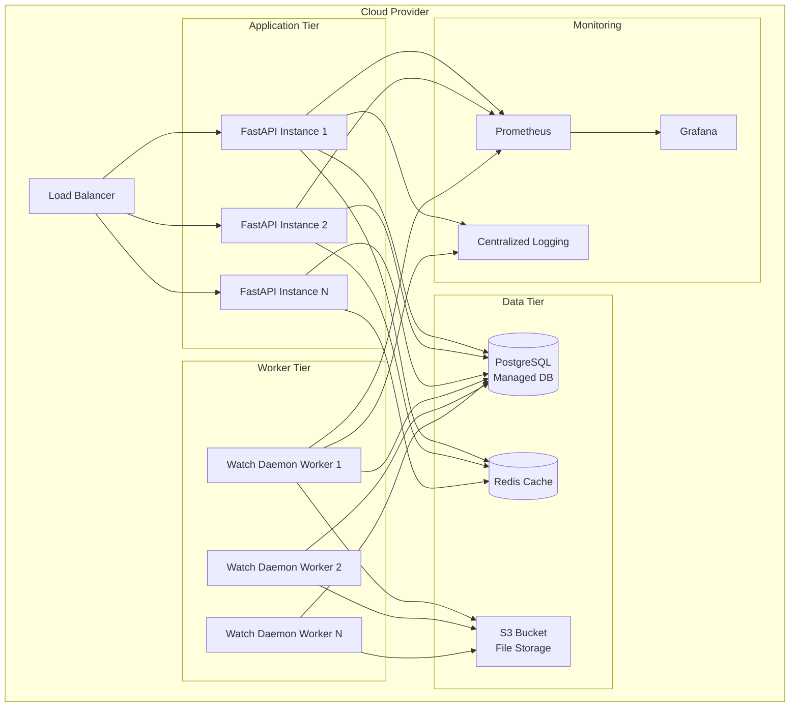

## Conclusion

CatSyphon's architecture prioritizes:

| Priority | Implementation |
|----------|---------------|
| **Extensibility** | Plugin system for new agent support |
| **Performance** | Incremental parsing (10-106x speedups), canonicalization caching |
| **Insights** | 60+ metrics across 6 categories |
| **Simplicity** | Standard patterns (REST API, React, PostgreSQL) |
| **Maintainability** | Clear separation of concerns, 84% test coverage |
| **Future-proofing** | Multi-tenancy ready, scalable design |

For more details, see:
- [Implementation Plan](./docs/implementation-plan.md)
- [Parser Plugin SDK](./docs/plugin-sdk.md)
- [Incremental Parsing Guide](./docs/incremental-parsing.md)
- [Canonicalization Architecture](./docs/canonicalization-architecture.md)
- [Insights Comprehensive Analysis](./docs/insights-comprehensive-analysis.md)
