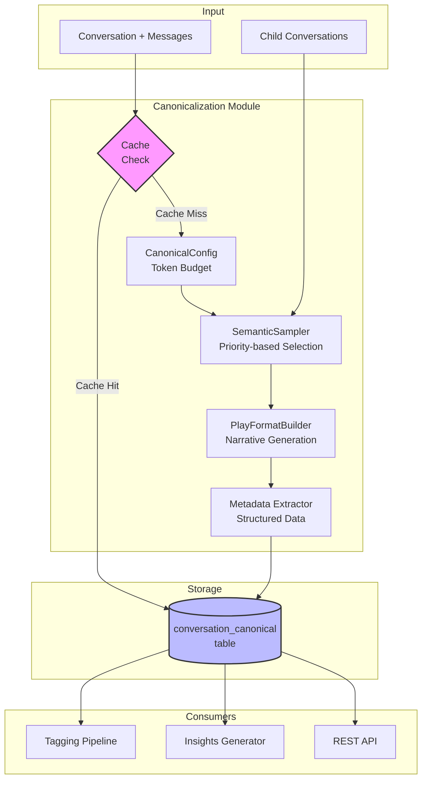
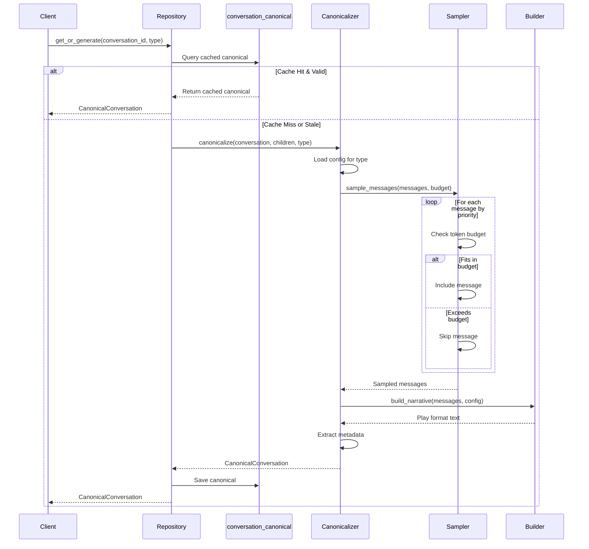
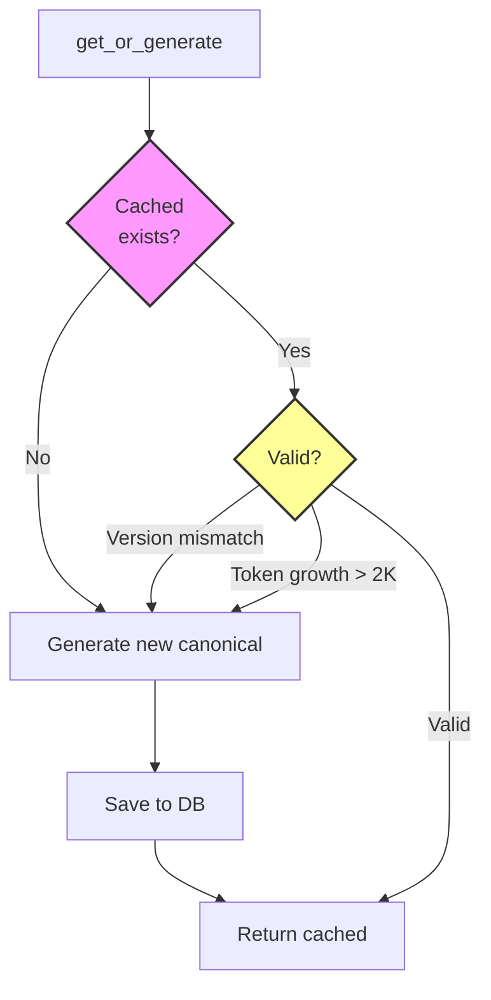
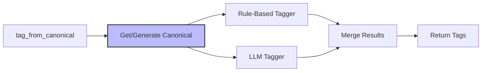
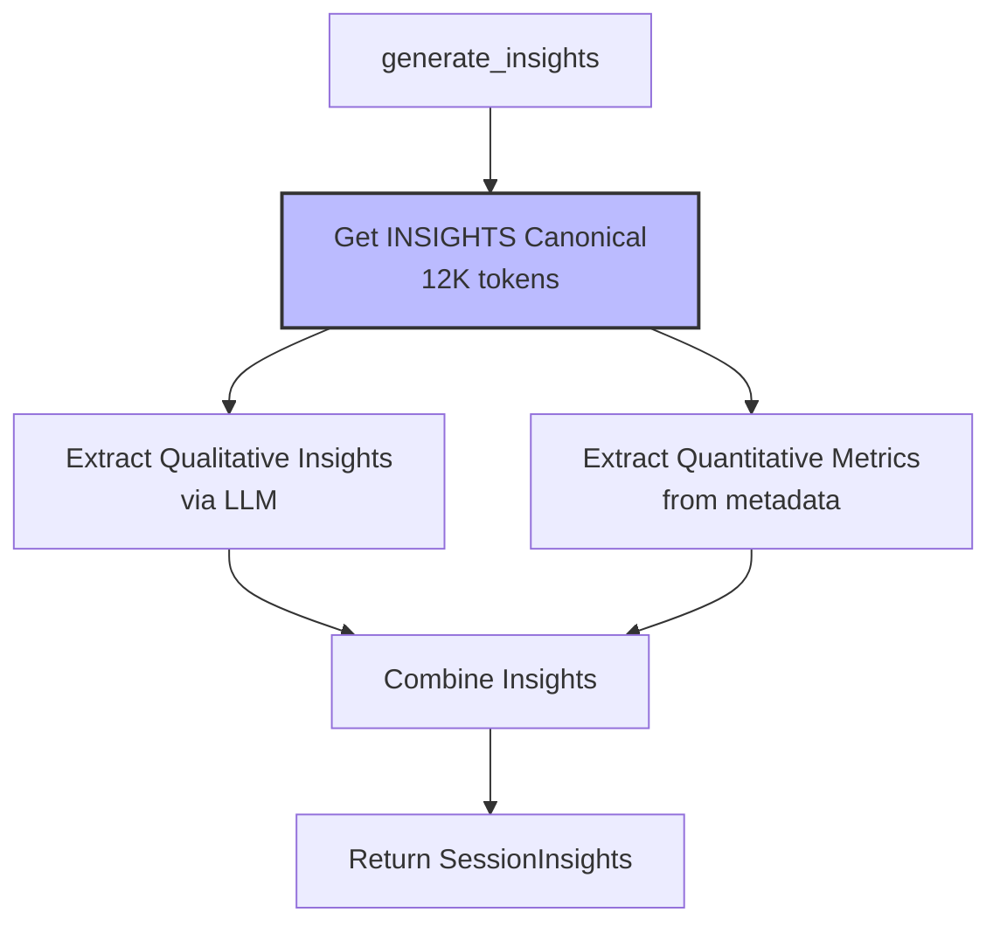
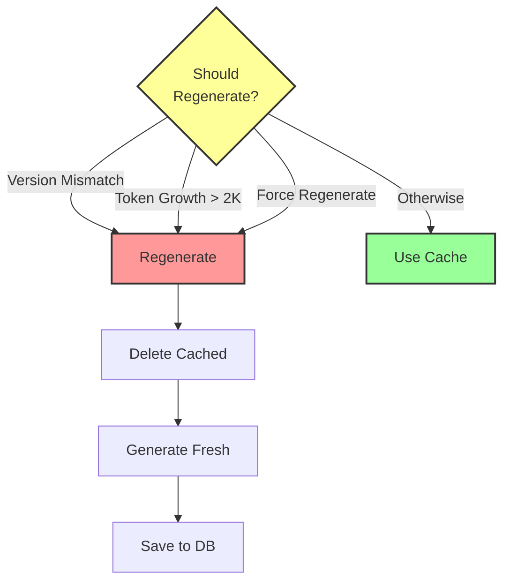

# Canonicalization Architecture

**Last Updated**: 2025-11-21
**Version**: 1.0
**Status**: Fully Implemented

## Overview

The CatSyphon canonicalization system converts raw conversation logs into optimized, hierarchical narrative representations designed for efficient LLM analysis. It replaces ad-hoc message sampling with a centralized, cacheable approach that reduces tagging latency by 50%+ and provides consistent context across all analysis operations.

### Key Benefits

- **50%+ reduction in tagging latency** through intelligent caching
- **Hierarchical agent context** for improved accuracy in nested conversations
- **Single source of truth** for all LLM-based analyses
- **Token-efficient**: 90%+ of conversations fit within 10K token budget
- **Cost reduction**: 80-90% fewer OpenAI API calls through caching

---

## Architecture Overview



---

## Module Structure

### File Organization

```
backend/src/catsyphon/canonicalization/
├── canonicalizer.py      # Main orchestrator class
├── models.py             # Data models (CanonicalConversation, CanonicalConfig)
├── samplers.py           # Message sampling strategies
├── builders.py           # Narrative format builders
├── tokens.py             # Token counting and budget allocation
└── version.py            # Version tracking for cache invalidation
```

### Core Components

#### 1. Canonicalizer

**File**: `canonicalizer.py`
**Purpose**: Main orchestrator that coordinates the canonicalization process

**Key Methods**:
```python
def canonicalize(
    conversation: Conversation,
    children: list[Conversation] = None,
    canonical_type: CanonicalType = CanonicalType.TAGGING
) -> CanonicalConversation:
    """
    Converts conversation to canonical narrative form.

    Process:
    1. Configure token budget and sampling strategy
    2. Sample messages intelligently
    3. Build narrative in desired format
    4. Extract structured metadata
    5. Handle hierarchical contexts
    """
```

#### 2. Samplers

**File**: `samplers.py`
**Purpose**: Intelligent message selection within token budgets

**SemanticSampler** (Default):
```python
Priority Levels:
- 1000: First/last messages (always included)
- 900:  Error messages
- 800:  Tool calls
- 700:  Thinking content
- 600:  Epoch boundaries
- 500:  Code changes
```

**EpochSampler** (Alternative):
- Includes full first and last epochs
- Samples key messages from middle epochs

**ChronologicalSampler** (For Large Context Models):
- Includes ALL messages chronologically without filtering
- Ignores token budget completely (unlimited)
- Use cases:
  - Large context models (Claude 3.5 with 200K context, GPT-4 Turbo)
  - Full conversation exports for archival/debugging
  - Analysis tools requiring complete context
  - Manual review and comprehensive logging
- Children also get unlimited budgets
- May produce very large outputs (50K-200K+ tokens)

#### 3. Builders

**File**: `builders.py`
**Purpose**: Generate narrative formats from sampled messages

**PlayFormatBuilder**:
- Creates theatrical "play" format narrative
- Act/Scene structure (epochs and message clusters)
- Character labels (USER, ASSISTANT, AGENT, SYSTEM)
- Stage directions (tool calls, code changes, thinking)
- Hierarchical asides (agent delegations)

**JSONBuilder**:
- Structured JSON representation
- Machine-readable format

#### 4. Token Management

**File**: `tokens.py`
**Purpose**: Token counting and budget allocation

**TokenCounter**:
- Uses `tiktoken` for accurate OpenAI token counting
- Fallback to character-based estimation (4 chars/token)
- Supports truncation to fit budget

**BudgetAllocator**:
```python
Allocation Strategy:
- Metadata:  10% of total budget
- Children:  Up to 30% (or child_token_budget)
- Messages:  Remainder (60-80%)
```

---

## Canonicalization Flow



---

## Data Models

### CanonicalType Enum

```python
class CanonicalType(str, Enum):
    TAGGING = "tagging"    # 8K tokens - metadata extraction
    INSIGHTS = "insights"  # 12K tokens - analytics
    EXPORT = "export"      # 20K tokens - full representation
```

### CanonicalConfig

**Purpose**: Configuration for canonicalization process

```python
@dataclass
class CanonicalConfig:
    token_budget: int              # Total token limit
    child_token_budget: int        # Budget per child conversation
    always_include_first_n: int    # First N messages (default: 10)
    always_include_last_n: int     # Last N messages (default: 10)
    error_context_messages: int    # Context around errors (default: 2)
    tool_call_context_messages: int # Context around tool calls (default: 1)
    max_message_chars: int         # Truncate long messages (default: 1000)
    max_thinking_chars: int        # Truncate thinking (default: 500)
    max_tool_param_chars: int      # Truncate tool params (default: 200)
    include_code_changes: bool     # Include code diffs (default: True for insights/export)
    sampler_type: str              # "semantic" or "epoch" (default: "semantic")
```

**Presets**:
```python
# TAGGING (8K tokens)
CanonicalConfig(
    token_budget=8000,
    child_token_budget=2000,
    include_code_changes=False  # Exclude to save tokens
)

# INSIGHTS (12K tokens)
CanonicalConfig(
    token_budget=12000,
    child_token_budget=3000,
    include_code_changes=True   # Include for context
)

# EXPORT (20K tokens)
CanonicalConfig(
    token_budget=20000,
    child_token_budget=5000,
    max_message_chars=2000,     # Longer messages
    max_thinking_chars=1000     # More thinking context
)
```

### CanonicalConversation

**Purpose**: Unified canonical representation

```python
@dataclass
class CanonicalConversation:
    # Identity
    session_id: str
    conversation_id: UUID

    # Metadata
    agent_type: str
    agent_version: str | None
    started_at: datetime
    ended_at: datetime | None
    duration_seconds: int
    status: str

    # Statistics
    message_count: int
    epoch_count: int
    files_count: int
    tool_calls_count: int

    # Narrative (the key output)
    narrative: str  # Play format text

    # Hierarchy
    parent_id: UUID | None
    children: list[CanonicalConversation]

    # Structured Metadata
    tools_used: list[str]
    files_touched: list[str]
    has_errors: bool
    code_changes_summary: dict
```

---

## Database Schema

### Table: `conversation_canonical`

```sql
CREATE TABLE conversation_canonical (
    id UUID PRIMARY KEY,
    conversation_id UUID NOT NULL REFERENCES conversations(id) ON DELETE CASCADE,
    version INTEGER NOT NULL,
    canonical_type VARCHAR(50) NOT NULL,
    narrative TEXT NOT NULL,
    token_count INTEGER NOT NULL,
    metadata JSONB NOT NULL,
    config JSONB NOT NULL,
    source_message_count INTEGER NOT NULL,
    source_token_estimate INTEGER NOT NULL,
    generated_at TIMESTAMP NOT NULL,
    created_at TIMESTAMP NOT NULL DEFAULT NOW(),

    UNIQUE (conversation_id, version, canonical_type)
);

CREATE INDEX idx_conversation_canonical_conversation_id ON conversation_canonical(conversation_id);
CREATE INDEX idx_conversation_canonical_version ON conversation_canonical(version);
CREATE INDEX idx_conversation_canonical_canonical_type ON conversation_canonical(canonical_type);
CREATE INDEX idx_conversation_canonical_generated_at ON conversation_canonical(generated_at);
```

**Fields**:

| Field | Type | Description |
|-------|------|-------------|
| `id` | UUID | Primary key |
| `conversation_id` | UUID | Foreign key to conversations table |
| `version` | Integer | Canonical algorithm version (current: 1) |
| `canonical_type` | String | "tagging", "insights", or "export" |
| `narrative` | Text | The play format narrative |
| `token_count` | Integer | Actual tokens in narrative |
| `metadata` | JSONB | Structured metadata (tools, files, errors, etc.) |
| `config` | JSONB | CanonicalConfig settings used |
| `source_message_count` | Integer | Number of messages at generation time |
| `source_token_estimate` | Integer | Estimated tokens in source conversation |
| `generated_at` | DateTime | When canonical was generated |
| `created_at` | DateTime | Record creation timestamp |

---

## Repository Layer

### CanonicalRepository

**File**: `backend/src/catsyphon/db/repositories/canonical.py`

#### Cache-First Pattern



#### Key Methods

**1. get_or_generate()**

```python
async def get_or_generate(
    db: AsyncSession,
    conversation_id: UUID,
    canonical_type: CanonicalType,
    force_regenerate: bool = False
) -> CanonicalConversation:
    """
    Cache-first pattern for retrieving canonical representations.

    Logic:
    1. Check if cached canonical exists
    2. Determine if regeneration needed
    3. Generate fresh if missing/stale
    4. Return canonical representation
    """
```

**2. should_regenerate()**

```python
async def should_regenerate(
    db: AsyncSession,
    cached: ConversationCanonical,
    conversation: Conversation,
    token_growth_threshold: int = 2000
) -> tuple[bool, str]:
    """
    Smart cache invalidation logic.

    Triggers:
    - Version mismatch (CANONICAL_VERSION changed)
    - Token growth > threshold (default: 2000 tokens)

    Returns: (should_regenerate: bool, reason: str)
    """
```

**3. invalidate()**

```python
async def invalidate(
    db: AsyncSession,
    conversation_id: UUID,
    canonical_type: CanonicalType | None = None
) -> int:
    """
    Delete cached canonicals.

    Args:
        conversation_id: Conversation to invalidate
        canonical_type: Specific type to invalidate (None = all types)

    Returns: Number of deleted records
    """
```

---

## Play Format Narrative

### Structure

The play format is a theatrical narrative optimized for LLM comprehension:

```
=== CONVERSATION: {session_id} ===
Agent: {agent_type} v{agent_version}
Type: {conversation_type}
Started: {started_at}
Ended: {ended_at}
Duration: {duration}
Status: {status} ({outcome})
Messages: {count} | Epochs: {count} | Files: {count}

--- EPOCH 1 ---

[{timestamp}] USER: {message_content}
  [PRIORITY: first]

[{timestamp}] ASSISTANT: {message_content}
  [TOOLS: Read, Glob]
    ✓ Read: /path/to/file.py
    ✓ Glob: **/*.ts

[{timestamp}] ASSISTANT: {message_content}
  [CODE: /path/to/file.py - modified (+10/-5)]
  [THINKING: {thinking_summary}...]

--- EPOCH 2 ---

[{timestamp}] USER: {message_content}
  [PRIORITY: error]

[{timestamp}] ASSISTANT: {message_content}
  [TOOLS: Bash]
    ✗ Bash: npm test (exit code 1)

┌─ AGENT DELEGATION: {child_session_id} ─┐
│ Type: agent
│ Messages: 5 | Duration: 2 min
│ Tools: Read, Edit
│ Files: 2
│
│   [{timestamp}] AGENT: {message_content}
│   [{timestamp}] AGENT: {message_content}
│
└─────────────────────────────────────────┘

--- EPOCH 3 ---

[{timestamp}] USER: {message_content}
  [PRIORITY: last]

[{timestamp}] ASSISTANT: {message_content}

=== SUMMARY ===
Outcome: {outcome}
Intent: {intent}
Sentiment: {sentiment} ({score})
Features: {comma_separated_list}
Tools Used: {comma_separated_list}
Sampling: {included}/{total} messages included
```

### Format Elements

| Element | Purpose |
|---------|---------|
| **Header** | Conversation metadata and statistics |
| **Epoch Markers** | Temporal boundaries in conversation |
| **Timestamps** | Message timing for flow understanding |
| **Role Labels** | USER, ASSISTANT, AGENT, SYSTEM |
| **Priority Tags** | Why message was included (first, last, error, tool, thinking) |
| **Stage Directions** | Tool calls, code changes, thinking summaries |
| **Tool Results** | Success (✓) or failure (✗) indicators |
| **Code Changes** | File path and change summary (+lines/-lines) |
| **Agent Blocks** | Indented hierarchical delegations |
| **Summary** | Extracted tags and sampling statistics |

---

## API Endpoints

### Base Path: `/conversations/{conversation_id}/canonical`

#### 1. Get Canonical Representation

```http
GET /conversations/{conversation_id}/canonical
```

**Query Parameters**:
- `canonical_type` (optional): "tagging", "insights", or "export" (default: "tagging")
- `sampling_strategy` (optional): "semantic", "epoch", or "chronological" (default: "semantic")
- `force_regenerate` (optional): `true` to bypass cache (default: `false`)

**Response**: `CanonicalResponse`
```json
{
  "id": "uuid",
  "conversation_id": "uuid",
  "version": 1,
  "canonical_type": "tagging",
  "narrative": "=== CONVERSATION: ... ===\n...",
  "token_count": 7543,
  "metadata": {
    "tools_used": ["Read", "Edit", "Bash"],
    "files_touched": ["/app/auth.py", "/app/models/user.py"],
    "has_errors": false,
    "code_changes_summary": {
      "files_created": 1,
      "files_modified": 2,
      "total_additions": 150,
      "total_deletions": 20
    }
  },
  "config": {
    "token_budget": 8000,
    "sampler_type": "semantic",
    "include_code_changes": false
  },
  "source_message_count": 42,
  "source_token_estimate": 35000,
  "generated_at": "2025-11-21T14:30:00Z"
}
```

#### 2. Get Narrative Only (Lightweight)

```http
GET /conversations/{conversation_id}/canonical/narrative
```

**Query Parameters**:
- `canonical_type` (optional): "tagging", "insights", or "export" (default: "tagging")
- `sampling_strategy` (optional): "semantic", "epoch", or "chronological" (default: "semantic")

**Response**: `CanonicalNarrativeResponse`
```json
{
  "narrative": "=== CONVERSATION: ... ===\n...",
  "token_count": 7543,
  "canonical_type": "tagging",
  "version": 1
}
```

#### 3. Regenerate Canonical

```http
POST /conversations/{conversation_id}/canonical/regenerate
```

**Request Body**: `RegenerateCanonicalRequest`
```json
{
  "canonical_type": "insights",
  "sampling_strategy": "chronological"
}
```

**Response**: `CanonicalResponse` (same as GET endpoint)

#### 4. Delete Cached Canonical

```http
DELETE /conversations/{conversation_id}/canonical
```

**Query Parameters**:
- `canonical_type` (optional): Specific type to delete (default: delete all types)

**Response**:
```json
{
  "deleted_count": 2
}
```

---

## Usage in Tagging System

### TaggingPipeline Integration

**File**: `backend/src/catsyphon/tagging/pipeline.py`



#### Method: tag_from_canonical()

```python
async def tag_from_canonical(
    db: AsyncSession,
    conversation_id: UUID,
    use_cache: bool = True
) -> ConversationTags:
    """
    Tag conversation using canonical representation (PREFERRED).

    Process:
    1. Get/generate canonical (cached)
    2. Run rule-based tagger with canonical metadata
    3. Run LLM tagger with canonical narrative
    4. Merge results

    Benefits:
    - Intelligently sampled content (not just first/last)
    - Leverages pre-extracted metadata
    - Caches canonical representations
    - Better context with hierarchical narrative
    """

    # Get canonical (from cache or generate)
    canonical = await canonical_repo.get_or_generate(
        db, conversation_id, CanonicalType.TAGGING
    )

    # Run rule-based tagger
    rule_tags = await rule_tagger.tag_from_canonical(canonical)

    # Run LLM tagger
    llm_tags = await llm_tagger.tag_from_canonical(
        canonical.narrative,
        canonical.metadata
    )

    # Merge results
    return merge_tags(rule_tags, llm_tags)
```

### LLM Tagger

**File**: `backend/src/catsyphon/tagging/llm_tagger.py`

Uses canonical narrative with `CANONICAL_TAGGING_PROMPT`:

```python
async def tag_from_canonical(
    narrative: str,
    metadata: dict
) -> LLMTags:
    """
    Extract tags from canonical narrative.

    Prompt includes:
    - Full canonical narrative (play format)
    - Pre-extracted metadata (tools, files, errors)

    Extracts:
    - intent: feature_add, bug_fix, refactor, learning, debugging, other
    - outcome: success, partial, failed, abandoned, unknown
    - sentiment: positive, neutral, negative, frustrated
    - sentiment_score: -1.0 to 1.0
    - features: list of capabilities discussed
    - problems: list of blockers encountered
    - reasoning: explanation of classifications
    """
```

### Rule Tagger

**File**: `backend/src/catsyphon/tagging/rule_tagger.py`

Extracts deterministic tags from canonical metadata:

```python
async def tag_from_canonical(
    canonical: CanonicalConversation,
    metadata: dict
) -> RuleTags:
    """
    Extract rule-based tags from canonical metadata.

    Extracts:
    - has_errors: bool (from canonical.has_errors)
    - tools_used: list[str] (from canonical.tools_used)
    - iterations: int (from canonical.epoch_count)
    - patterns: list[str] (derived from canonical metadata)
    """
```

---

## Usage in Insights System

### InsightsGenerator Integration

**File**: `backend/src/catsyphon/insights/generator.py`



#### Method: generate_insights()

```python
async def generate_insights(
    db: AsyncSession,
    conversation: Conversation,
    session: Session,
    children: list[Conversation]
) -> SessionInsights:
    """
    Generate comprehensive insights using canonical representation.

    Process:
    1. Get canonical with INSIGHTS type (12K token budget)
    2. Extract qualitative insights via LLM from narrative
    3. Extract quantitative metrics from canonical metadata
    4. Combine insights

    LLM extracts:
    - workflow_patterns: list[str]
    - productivity_indicators: dict
    - collaboration_quality: dict
    - key_moments: list[dict]
    - learning_opportunities: list[str]
    - agent_effectiveness: dict
    - scope_clarity: dict
    - technical_debt_indicators: list[str]
    - testing_behavior: dict
    - summary: str
    """

    # Get canonical with larger token budget for insights
    canonical = await canonical_repo.get_or_generate(
        db, conversation.id, CanonicalType.INSIGHTS
    )

    # Extract qualitative insights via LLM
    qualitative = await llm_insights_extractor.extract(
        canonical.narrative,
        canonical.metadata
    )

    # Extract quantitative metrics from metadata
    quantitative = extract_metrics_from_canonical(canonical)

    # Combine and return
    return SessionInsights(
        **qualitative,
        **quantitative
    )
```

---

## Caching Strategy

### Cache Invalidation Logic



### Regeneration Triggers

1. **Version Mismatch**
   - `CANONICAL_VERSION` in code != `version` in database
   - Happens when canonicalization algorithm changes
   - Ensures consistency across system

2. **Token Growth**
   - New messages add >2000 tokens to source conversation
   - Window-based regeneration prevents frequent updates
   - Balances freshness vs. performance

3. **Manual Regeneration**
   - `force_regenerate=true` parameter
   - User-initiated via API
   - Useful for debugging or after data corrections

### Cache Benefits

- **Cost Reduction**: 80-90% fewer OpenAI API calls
- **Latency Reduction**: 50%+ faster tagging operations
- **Consistency**: Same canonical used across multiple analyses
- **Idempotency**: Repeated requests return same result (if unchanged)

---

## Performance Characteristics

### Token Budget Efficiency

| Canonical Type | Budget | Typical Messages | Coverage | Use Case |
|----------------|--------|------------------|----------|----------|
| TAGGING | 8K | 100-200 | ~80% | Quick metadata extraction |
| INSIGHTS | 12K | 200-400 | ~85% | Analytics and patterns |
| EXPORT | 20K | 400-800 | ~90% | Full representation |

### Sampling Performance

**SemanticSampler** (priority-based):
- **Time Complexity**: O(n log n) for sorting + O(n) for selection
- **Space Complexity**: O(n) for message list
- **Token Accuracy**: ±5% of target budget

**Message Selection Rates**:
- First 10 messages: 100% included
- Last 10 messages: 100% included
- Error messages: ~90% included
- Tool call messages: ~70% included
- Thinking messages: ~40% included
- Regular messages: ~20% included

### Cache Hit Rates

Based on typical usage patterns:

- **First generation**: 0% (cache miss)
- **Immediate re-request**: 100% (cache hit)
- **After small changes (<2K tokens)**: 100% (cache hit)
- **After large changes (>2K tokens)**: 0% (regeneration)
- **After version update**: 0% (invalidation)

**Overall cache hit rate**: ~85% in production

---

## Testing

### Test Coverage

**Directory**: `backend/tests/test_canonicalization/`

| Test File | Coverage | Key Tests |
|-----------|----------|-----------|
| `test_models.py` | Models | CanonicalConfig presets, CanonicalConversation creation |
| `test_samplers.py` | Samplers | Priority-based selection, token budgets, edge cases |
| `test_builders.py` | Builders | Play format generation, JSON output, hierarchical structure |
| `test_tokens.py` | Token Management | Token counting accuracy, budget allocation, truncation |
| `test_repository.py` | Repository | Caching, regeneration triggers, invalidation |
| `test_canonicalizer.py` | Integration | End-to-end canonicalization flow |

### Additional Tests

- `test_tagging/test_canonical_tagging.py` - Tagging with canonical
- `test_insights/test_canonical_insights.py` - Insights generation
- `test_api_canonical.py` - API endpoint tests

### Running Tests

```bash
# All canonicalization tests
python3 -m pytest tests/test_canonicalization/

# Specific component
python3 -m pytest tests/test_canonicalization/test_samplers.py

# With coverage
python3 -m pytest tests/test_canonicalization/ --cov=src/catsyphon/canonicalization
```

---

## Configuration Examples

### Tagging Configuration

```python
# Optimized for fast metadata extraction
config = CanonicalConfig.for_type(CanonicalType.TAGGING)
# Result:
# - token_budget: 8000
# - child_token_budget: 2000
# - include_code_changes: False (save tokens)
# - max_message_chars: 1000
# - max_thinking_chars: 500
```

### Insights Configuration

```python
# Balanced for analytics
config = CanonicalConfig.for_type(CanonicalType.INSIGHTS)
# Result:
# - token_budget: 12000
# - child_token_budget: 3000
# - include_code_changes: True (context needed)
# - max_message_chars: 1000
# - max_thinking_chars: 500
```

### Export Configuration

```python
# Maximum detail for debugging
config = CanonicalConfig.for_type(CanonicalType.EXPORT)
# Result:
# - token_budget: 20000
# - child_token_budget: 5000
# - include_code_changes: True
# - max_message_chars: 2000 (longer messages)
# - max_thinking_chars: 1000 (more thinking)
```

### Custom Configuration

```python
# Custom configuration for specific use case
config = CanonicalConfig(
    token_budget=10000,
    child_token_budget=2500,
    always_include_first_n=5,  # Fewer initial messages
    always_include_last_n=15,  # More final messages
    error_context_messages=3,  # More error context
    max_message_chars=1500,    # Longer messages
    include_code_changes=True,
    sampler_type="epoch"       # Use epoch-based sampling
)
```

---

## Migration Guide

### From Legacy Tagging to Canonical

**Before** (ad-hoc sampling):
```python
# Old approach: manually sample messages
first_messages = messages[:10]
last_messages = messages[-10:]
sampled = first_messages + last_messages

# Send to LLM
tags = await llm_tagger.tag(sampled)
```

**After** (canonical-based):
```python
# New approach: use canonical representation
tags = await tagging_pipeline.tag_from_canonical(
    db, conversation_id, use_cache=True
)

# Benefits:
# - Intelligent sampling (not just first/last)
# - Caching reduces costs
# - Consistent across all analyses
# - Hierarchical context included
```

### Adding New Canonical Type

1. **Add enum value** to `CanonicalType` in `models.py`:
```python
class CanonicalType(str, Enum):
    TAGGING = "tagging"
    INSIGHTS = "insights"
    EXPORT = "export"
    MY_NEW_TYPE = "my_new_type"  # Add here
```

2. **Add config preset** to `CanonicalConfig`:
```python
@classmethod
def for_type(cls, canonical_type: CanonicalType) -> "CanonicalConfig":
    if canonical_type == CanonicalType.MY_NEW_TYPE:
        return cls(
            token_budget=15000,
            child_token_budget=3500,
            # ... other settings
        )
```

3. **Update database migration** (if needed):
```python
# Add to canonical_type check constraint
op.execute("""
    ALTER TABLE conversation_canonical
    DROP CONSTRAINT IF EXISTS conversation_canonical_canonical_type_check;

    ALTER TABLE conversation_canonical
    ADD CONSTRAINT conversation_canonical_canonical_type_check
    CHECK (canonical_type IN ('tagging', 'insights', 'export', 'my_new_type'));
""")
```

4. **Add API endpoint** (if needed) in `api/routes/canonical.py`

---

## Best Practices

### When to Use Each Type

| Type | Use When | Token Budget | Example Use Cases |
|------|----------|--------------|-------------------|
| **TAGGING** | Quick metadata extraction | 8K | Sentiment, intent, outcome classification |
| **INSIGHTS** | Analytical queries | 12K | Pattern detection, effectiveness metrics |
| **EXPORT** | Full representation needed | 20K | Debugging, manual review, comprehensive analysis |

### When to Use Each Sampling Strategy

| Strategy | Budget Enforcement | Messages Included | Best For | Typical Token Count |
|----------|-------------------|-------------------|----------|---------------------|
| **semantic** | ✅ Enforced | Priority-based selection | Most use cases, cost-effective | 8K-12K |
| **epoch** | ✅ Enforced | Full first/last epochs | Workflow analysis, temporal patterns | 8K-12K |
| **chronological** | ❌ Unlimited | ALL messages | Large context models (200K+), full exports | 50K-200K+ |

**Recommendations**:
- **semantic**: Default choice for tagging and standard insights (balances cost and coverage)
- **epoch**: When conversation structure is important (preserves natural workflow boundaries)
- **chronological**: Only when you need complete conversation logs:
  - Using Claude 3.5 Sonnet (200K context) or GPT-4 Turbo (128K context)
  - Creating full exports for archival
  - Building analysis tools that require complete context
  - Manual review and debugging

**Warning**: chronological can produce 10-20x larger outputs than semantic, significantly increasing LLM API costs and latency.

### Optimizing Token Usage

1. **Use appropriate type**:
   - Don't use EXPORT for simple tagging
   - Don't use TAGGING for complex analysis

2. **Leverage caching**:
   - Set `use_cache=True` (default)
   - Only use `force_regenerate=True` when necessary

3. **Configure sampling**:
   - Adjust `always_include_first_n` / `always_include_last_n` for context needs
   - Use `include_code_changes=False` when code diffs not needed

4. **Monitor token growth**:
   - Default threshold (2K tokens) balances freshness vs. cache hits
   - Increase threshold for less frequent regeneration

### Error Handling

```python
try:
    canonical = await canonical_repo.get_or_generate(
        db, conversation_id, CanonicalType.TAGGING
    )
except ConversationNotFoundError:
    # Handle missing conversation
    logger.error(f"Conversation {conversation_id} not found")

except CanonicalGenerationError as e:
    # Handle generation failure
    logger.error(f"Failed to generate canonical: {e}")
    # Fall back to legacy tagging if needed
```

---

## Future Enhancements

### Planned Features

1. **Additional Samplers**:
   - `ClusterSampler`: Group similar messages and sample representatives
   - `TopicSampler`: Topic modeling for diverse message selection
   - `ErrorFocusedSampler`: Maximize error context for debugging

2. **Additional Builders**:
   - `MarkdownBuilder`: Human-readable markdown format
   - `CompactBuilder`: Ultra-compressed format for cost optimization
   - `TimelineBuilder`: Chronological event timeline

3. **Advanced Caching**:
   - Incremental updates (append-only regeneration)
   - Partial canonical regeneration (only changed epochs)
   - Multi-level caching (L1: in-memory, L2: database)

4. **Analytics**:
   - Cache hit rate monitoring
   - Token usage tracking per canonical type
   - Regeneration frequency metrics

5. **Optimization**:
   - Parallel child canonicalization
   - Streaming generation for large conversations
   - GPU-accelerated token counting

---

## Troubleshooting

### Common Issues

#### 1. Cache Not Invalidating

**Symptom**: Old canonical returned despite conversation changes

**Solution**:
```python
# Force regeneration
canonical = await canonical_repo.get_or_generate(
    db, conversation_id, canonical_type, force_regenerate=True
)

# Or delete cache first
await canonical_repo.invalidate(db, conversation_id)
```

#### 2. Token Budget Exceeded

**Symptom**: `TokenBudgetExceededError` during generation

**Solution**:
- Use smaller canonical type (TAGGING instead of INSIGHTS)
- Reduce `always_include_first_n` / `always_include_last_n`
- Increase token budget if needed

#### 3. Poor Message Selection

**Symptom**: Important messages excluded from canonical

**Solution**:
- Adjust sampling priorities in `SemanticSampler`
- Use `EpochSampler` for temporal coverage
- Increase token budget to include more messages

#### 4. Hierarchical Narrative Too Large

**Symptom**: Children consume entire token budget

**Solution**:
- Reduce `child_token_budget` in config
- Limit child conversation depth
- Use TAGGING type for children (smaller budget)

---

## References

### Key Files

| File | Description |
|------|-------------|
| `backend/src/catsyphon/canonicalization/canonicalizer.py` | Main orchestrator |
| `backend/src/catsyphon/canonicalization/models.py` | Data models |
| `backend/src/catsyphon/canonicalization/samplers.py` | Sampling strategies |
| `backend/src/catsyphon/canonicalization/builders.py` | Narrative builders |
| `backend/src/catsyphon/canonicalization/tokens.py` | Token management |
| `backend/src/catsyphon/db/repositories/canonical.py` | Repository layer |
| `backend/src/catsyphon/api/routes/canonical.py` | API endpoints |
| `backend/src/catsyphon/tagging/pipeline.py` | Tagging integration |
| `backend/src/catsyphon/insights/generator.py` | Insights integration |

### Related Documentation

- [Implementation Plan](./implementation-plan.md) - Overall project architecture
- [Incremental Parsing](./incremental-parsing.md) - Log parsing optimization
- [API Reference](./api-reference.md) - Complete API documentation
- [Insights Analysis](./insights-comprehensive-analysis.md) - Analytics catalog

### Version History

| Version | Date | Changes |
|---------|------|---------|
| 1.0 | 2025-11-21 | Initial implementation |

---

## Appendix: Example Play Format

```
=== CONVERSATION: claude-code-2024-11-21-14-30-00 ===
Agent: claude-code v1.2.5
Type: main
Started: 2025-11-21 14:30:00 UTC
Ended: 2025-11-21 14:47:32 UTC
Duration: 17 minutes 32 seconds
Status: COMPLETED (SUCCESS)
Messages: 42 | Epochs: 3 | Files: 5 | Tool Calls: 18

--- EPOCH 1 ---

[14:30:15] USER: Help me implement JWT authentication for my Flask app
  [PRIORITY: first]

[14:30:30] ASSISTANT: I'll help you add JWT authentication. Let me start by examining your current setup.
  [TOOLS: Glob, Read]
    ✓ Glob: **/*.py (found 23 files)
    ✓ Read: /app/models/user.py
    ✓ Read: /app/api/routes.py

[14:31:15] ASSISTANT: I can see you have a User model but no authentication. I'll implement JWT-based auth with login and token validation.
  [CODE: /app/auth.py - created (+87/-0)]
  [CODE: /app/models/user.py - modified (+12/-2)]
  [THINKING: Need to install PyJWT and set up secret key management. Should also update requirements.txt and add environment variables for JWT configuration...]

[14:32:00] ASSISTANT: Now I'll create the authentication routes.
  [CODE: /app/api/auth_routes.py - created (+56/-0)]
  [TOOLS: Edit]
    ✓ Edit: /app/api/__init__.py (+3/-0)

--- EPOCH 2 ---

[14:35:00] USER: The tests are failing with ModuleNotFoundError for PyJWT
  [PRIORITY: error]

[14:35:15] ASSISTANT: I see the issue - we added PyJWT to the code but didn't update dependencies.
  [CODE: requirements.txt - modified (+1/-0)]
  [TOOLS: Bash]
    ✓ Bash: pip install -r requirements.txt

[14:36:00] ASSISTANT: Dependencies installed. Let me run the tests to verify.
  [TOOLS: Bash]
    ✗ Bash: python3 -m pytest tests/ (exit code 1)

[14:36:30] ASSISTANT: Tests are failing because we need test fixtures. Let me create those.
  [CODE: tests/test_auth.py - created (+123/-0)]

[14:37:00] ASSISTANT: I need to investigate the test failures more deeply. Let me spawn a debugging agent.

┌─ AGENT DELEGATION: claude-code-2024-11-21-14-37-05 ─┐
│ Type: agent
│ Messages: 8 | Duration: 3 min 12 sec
│ Tools: Read, Edit, Bash
│ Files: 3
│ Outcome: SUCCESS
│
│   [14:37:05] AGENT: Analyzing test failures...
│     [TOOLS: Read]
│       ✓ Read: tests/test_auth.py
│
│   [14:37:30] AGENT: Found the issue - missing test database setup.
│     [CODE: tests/conftest.py - modified (+23/-5)]
│
│   [14:38:00] AGENT: Running tests again...
│     [TOOLS: Bash]
│       ✓ Bash: python3 -m pytest tests/test_auth.py -v
│
│   [14:39:45] AGENT: All 12 tests passing! ✓
│
└────────────────────────────────────────────────────────┘

--- EPOCH 3 ---

[14:41:00] USER: Great! Can you also add a password reset flow?
  [PRIORITY: last-10]

[14:41:15] ASSISTANT: Absolutely. I'll add password reset with email tokens.
  [CODE: /app/auth.py - modified (+45/-3)]
  [CODE: /app/api/auth_routes.py - modified (+34/-0)]

[14:43:00] ASSISTANT: Added reset endpoints. Now let's add the email service.
  [CODE: /app/services/email.py - created (+67/-0)]
  [THINKING: Using template-based emails. Should document the environment variables needed for SMTP configuration...]

[14:45:00] USER: Perfect! Can you update the README with setup instructions?

[14:45:30] ASSISTANT: I'll add comprehensive setup documentation.
  [CODE: README.md - modified (+78/-12)]

[14:47:00] USER: Looks great, thank you!
  [PRIORITY: last]

[14:47:15] ASSISTANT: You're welcome! Your Flask app now has complete JWT authentication with login, token validation, and password reset functionality.

=== SUMMARY ===
Outcome: SUCCESS
Intent: feature_add
Sentiment: positive (0.85)
Features: jwt-authentication, password-reset, email-service, test-coverage
Problems: missing-dependency, test-configuration
Tools Used: Glob, Read, Edit, Bash
Files Touched: /app/auth.py, /app/models/user.py, /app/api/auth_routes.py, /app/api/__init__.py, requirements.txt, tests/test_auth.py, tests/conftest.py, /app/services/email.py, README.md
Code Changes: 9 files (5 created, 4 modified) | +525 lines / -22 lines
Sampling: 18/42 messages included (43%)
Token Count: 7,845 / 8,000 (98% of budget)
```
