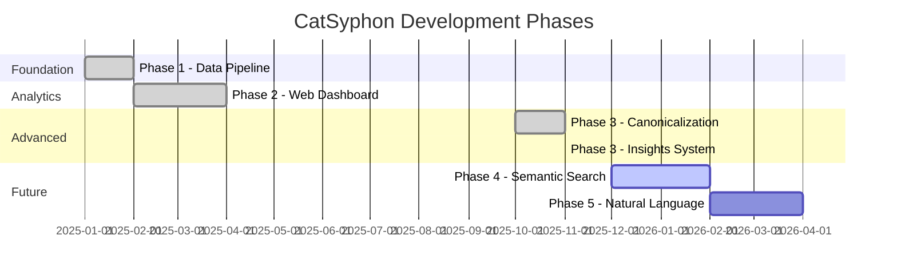
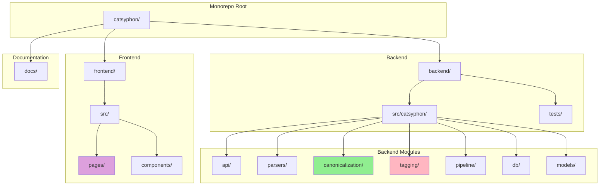

# CatSyphon Implementation Plan

**Project**: Coding Agent Conversation Analysis Tool
**Version**: 2.0
**Last Updated**: 2025-11-26

## Executive Summary

CatSyphon is a full-stack application for parsing, analyzing, and extracting insights from AI coding assistant conversation logs. The tool parses logs from multiple coding agents (starting with Claude Code), enriches them with AI-generated metadata, and provides analytics dashboards for engineering managers, product teams, and AI researchers.

**Current Status**: Phases 1-3 complete. Core platform operational with parsing, tagging, web UI, canonicalization, and insights.

---

## Project Phases Overview



### Phase 1: Data Foundation & Processing Pipeline ✅ COMPLETE
Robust parsing, metadata enrichment, and storage infrastructure.
- Plugin-based parser system with auto-detection
- Incremental parsing (10x-106x faster)
- Hash-based deduplication
- Live directory watching daemon
- AI-powered tagging with caching

### Phase 2: Core Analytics Dashboards ✅ COMPLETE
Web interface with project analytics and conversation exploration.
- React 19 + TypeScript frontend
- Project-level analytics with sentiment timelines
- Session filtering and search
- Real-time polling (15s intervals)
- Watch directory management UI

### Phase 3: Canonicalization & Insights ✅ COMPLETE
LLM-optimized conversation representation and comprehensive insights.
- Intelligent message sampling within token budgets
- Play-format narrative generation
- 60+ insights across 6 categories
- Hierarchical context preservation
- 50%+ tagging latency reduction

### Phase 4: Semantic Search (Future)
Natural language queries across conversations using pgvector.

### Phase 5: Natural Language Interface (Future)
Conversational UI for asking questions about the data.

---

## Phase 1: Detailed Implementation Plan

### 1.1 Database Schema Design

**Objective**: Design and implement PostgreSQL schema for storing conversations, messages, and enriched metadata.

**Schema Components**:

#### Core Tables

```sql
-- Projects table
CREATE TABLE projects (
    id UUID PRIMARY KEY DEFAULT gen_random_uuid(),
    name VARCHAR(255) NOT NULL,
    description TEXT,
    created_at TIMESTAMP WITH TIME ZONE DEFAULT NOW(),
    updated_at TIMESTAMP WITH TIME ZONE DEFAULT NOW()
);

-- Developers table
CREATE TABLE developers (
    id UUID PRIMARY KEY DEFAULT gen_random_uuid(),
    username VARCHAR(255) NOT NULL,
    email VARCHAR(255),
    metadata JSONB DEFAULT '{}',
    created_at TIMESTAMP WITH TIME ZONE DEFAULT NOW()
);

-- Conversations table
CREATE TABLE conversations (
    id UUID PRIMARY KEY DEFAULT gen_random_uuid(),
    project_id UUID REFERENCES projects(id),
    developer_id UUID REFERENCES developers(id),
    agent_type VARCHAR(50) NOT NULL, -- 'claude-code', 'copilot', 'cursor', etc.
    agent_version VARCHAR(50),
    start_time TIMESTAMP WITH TIME ZONE NOT NULL,
    end_time TIMESTAMP WITH TIME ZONE,
    status VARCHAR(50) DEFAULT 'open', -- 'open', 'completed', 'abandoned'
    success BOOLEAN,
    iteration_count INTEGER DEFAULT 1,

    -- Metadata (flexible storage for additional fields)
    tags JSONB DEFAULT '{}',
    metadata JSONB DEFAULT '{}',

    created_at TIMESTAMP WITH TIME ZONE DEFAULT NOW(),
    updated_at TIMESTAMP WITH TIME ZONE DEFAULT NOW()
);

-- Epochs table (conversation segments/turns)
CREATE TABLE epochs (
    id UUID PRIMARY KEY DEFAULT gen_random_uuid(),
    conversation_id UUID REFERENCES conversations(id) ON DELETE CASCADE,
    sequence INTEGER NOT NULL, -- order within conversation

    -- Classification
    intent VARCHAR(100), -- 'feature_add', 'bug_fix', 'refactor', 'question', etc.
    outcome VARCHAR(100), -- 'success', 'failure', 'partial', 'blocked'

    -- Sentiment analysis
    sentiment VARCHAR(50), -- 'positive', 'neutral', 'negative', 'frustrated', 'satisfied'
    sentiment_score FLOAT, -- -1.0 to 1.0

    -- Timing
    start_time TIMESTAMP WITH TIME ZONE NOT NULL,
    end_time TIMESTAMP WITH TIME ZONE,
    duration_seconds INTEGER,

    -- Additional metadata
    metadata JSONB DEFAULT '{}',

    created_at TIMESTAMP WITH TIME ZONE DEFAULT NOW(),

    UNIQUE(conversation_id, sequence)
);

-- Messages table
CREATE TABLE messages (
    id UUID PRIMARY KEY DEFAULT gen_random_uuid(),
    epoch_id UUID REFERENCES epochs(id) ON DELETE CASCADE,
    conversation_id UUID REFERENCES conversations(id) ON DELETE CASCADE,

    role VARCHAR(50) NOT NULL, -- 'user', 'assistant', 'system'
    content TEXT NOT NULL,
    timestamp TIMESTAMP WITH TIME ZONE NOT NULL,
    sequence INTEGER NOT NULL, -- order within epoch

    -- Tool usage
    tool_calls JSONB DEFAULT '[]',
    tool_results JSONB DEFAULT '[]',

    -- Code changes
    code_changes JSONB DEFAULT '[]',

    -- Extracted entities
    entities JSONB DEFAULT '{}', -- files, functions, libraries, technologies

    metadata JSONB DEFAULT '{}',

    created_at TIMESTAMP WITH TIME ZONE DEFAULT NOW(),

    UNIQUE(epoch_id, sequence)
);

-- Files touched during conversations
CREATE TABLE files_touched (
    id UUID PRIMARY KEY DEFAULT gen_random_uuid(),
    conversation_id UUID REFERENCES conversations(id) ON DELETE CASCADE,
    epoch_id UUID REFERENCES epochs(id) ON DELETE CASCADE,
    message_id UUID REFERENCES messages(id) ON DELETE CASCADE,

    file_path TEXT NOT NULL,
    change_type VARCHAR(50), -- 'created', 'modified', 'deleted', 'read'
    lines_added INTEGER DEFAULT 0,
    lines_deleted INTEGER DEFAULT 0,
    lines_modified INTEGER DEFAULT 0,

    timestamp TIMESTAMP WITH TIME ZONE NOT NULL,
    metadata JSONB DEFAULT '{}',

    created_at TIMESTAMP WITH TIME ZONE DEFAULT NOW()
);

-- Conversation tags (extracted insights)
CREATE TABLE conversation_tags (
    id UUID PRIMARY KEY DEFAULT gen_random_uuid(),
    conversation_id UUID REFERENCES conversations(id) ON DELETE CASCADE,

    tag_type VARCHAR(100) NOT NULL, -- 'feature', 'technology', 'problem', 'pattern'
    tag_value VARCHAR(255) NOT NULL,
    confidence FLOAT, -- 0.0 to 1.0

    metadata JSONB DEFAULT '{}',

    created_at TIMESTAMP WITH TIME ZONE DEFAULT NOW(),

    UNIQUE(conversation_id, tag_type, tag_value)
);

-- Raw logs (preserve originals for reprocessing)
CREATE TABLE raw_logs (
    id UUID PRIMARY KEY DEFAULT gen_random_uuid(),
    conversation_id UUID REFERENCES conversations(id) ON DELETE CASCADE,

    agent_type VARCHAR(50) NOT NULL,
    log_format VARCHAR(50) NOT NULL, -- 'json', 'markdown', 'xml', etc.
    raw_content TEXT NOT NULL,
    file_path TEXT,

    imported_at TIMESTAMP WITH TIME ZONE DEFAULT NOW(),
    metadata JSONB DEFAULT '{}',

    created_at TIMESTAMP WITH TIME ZONE DEFAULT NOW()
);
```

#### Indexes

```sql
-- Conversation indexes
CREATE INDEX idx_conversations_project ON conversations(project_id);
CREATE INDEX idx_conversations_developer ON conversations(developer_id);
CREATE INDEX idx_conversations_agent ON conversations(agent_type);
CREATE INDEX idx_conversations_time ON conversations(start_time);
CREATE INDEX idx_conversations_status ON conversations(status);
CREATE INDEX idx_conversations_tags ON conversations USING GIN (tags);

-- Epoch indexes
CREATE INDEX idx_epochs_conversation ON epochs(conversation_id);
CREATE INDEX idx_epochs_intent ON epochs(intent);
CREATE INDEX idx_epochs_sentiment ON epochs(sentiment);
CREATE INDEX idx_epochs_time ON epochs(start_time);

-- Message indexes
CREATE INDEX idx_messages_epoch ON messages(epoch_id);
CREATE INDEX idx_messages_conversation ON messages(conversation_id);
CREATE INDEX idx_messages_timestamp ON messages(timestamp);
CREATE INDEX idx_messages_entities ON messages USING GIN (entities);

-- Files touched indexes
CREATE INDEX idx_files_conversation ON files_touched(conversation_id);
CREATE INDEX idx_files_epoch ON files_touched(epoch_id);
CREATE INDEX idx_files_path ON files_touched(file_path);

-- Tag indexes
CREATE INDEX idx_tags_conversation ON conversation_tags(conversation_id);
CREATE INDEX idx_tags_type ON conversation_tags(tag_type);
CREATE INDEX idx_tags_value ON conversation_tags(tag_value);

-- Full-text search
CREATE INDEX idx_messages_content_fts ON messages
USING GIN (to_tsvector('english', content));
```

#### Future: Vector Embeddings (Phase 3)

```sql
-- Install pgvector extension
CREATE EXTENSION IF NOT EXISTS vector;

-- Embeddings table
CREATE TABLE conversation_embeddings (
    id UUID PRIMARY KEY DEFAULT gen_random_uuid(),
    conversation_id UUID REFERENCES conversations(id) ON DELETE CASCADE,
    epoch_id UUID REFERENCES epochs(id) ON DELETE CASCADE,

    embedding_model VARCHAR(100) NOT NULL, -- 'text-embedding-ada-002', etc.
    embedding vector(1536), -- dimension depends on model

    created_at TIMESTAMP WITH TIME ZONE DEFAULT NOW(),

    UNIQUE(conversation_id, epoch_id, embedding_model)
);

CREATE INDEX idx_embeddings_vector ON conversation_embeddings
USING ivfflat (embedding vector_cosine_ops)
WITH (lists = 100);
```

**Migration Strategy**:
- Use Alembic for database migrations
- Version all schema changes
- Support rollback for failed migrations
- Test migrations on sample data before production

---

### 1.2 Claude Code Log Parser

**Objective**: Build robust parser to extract structured data from Claude Code conversation logs.

**Input Format**: Claude Code logs (JSON format, likely from export feature)

**Parser Architecture**:

```python
# Abstract base class for all parsers
class ConversationParser(Protocol):
    """Base protocol for agent log parsers."""

    def can_parse(self, data: Any) -> bool:
        """Check if this parser can handle the given data."""
        ...

    def parse(self, data: Any) -> ParsedConversation:
        """Parse raw data into structured format."""
        ...

# Claude Code specific parser
class ClaudeCodeParser(ConversationParser):
    """Parser for Claude Code conversation logs."""

    def can_parse(self, data: Any) -> bool:
        # Check for Claude Code specific markers
        ...

    def parse(self, data: Any) -> ParsedConversation:
        # Extract conversations, messages, tool calls, code changes
        ...

    def _extract_tool_calls(self, message: dict) -> list[ToolCall]:
        # Parse tool invocations (Bash, Read, Write, Edit, etc.)
        ...

    def _extract_code_changes(self, message: dict) -> list[CodeChange]:
        # Parse code modifications from Edit/Write tools
        ...

    def _extract_entities(self, content: str) -> dict:
        # Extract file paths, function names, libraries mentioned
        ...

# Common intermediate representation
@dataclass
class ParsedConversation:
    """Unified format for all parsed conversations."""
    agent_type: str
    agent_version: Optional[str]
    start_time: datetime
    end_time: Optional[datetime]
    messages: list[ParsedMessage]
    metadata: dict

@dataclass
class ParsedMessage:
    """Single message in a conversation."""
    role: str  # 'user', 'assistant', 'system'
    content: str
    timestamp: datetime
    tool_calls: list[ToolCall]
    code_changes: list[CodeChange]
    entities: dict

@dataclass
class ToolCall:
    """Tool invocation by agent."""
    tool_name: str
    parameters: dict
    result: Optional[str]
    success: bool
    timestamp: datetime

@dataclass
class CodeChange:
    """Code modification."""
    file_path: str
    change_type: str  # 'create', 'edit', 'delete'
    old_content: Optional[str]
    new_content: Optional[str]
    lines_added: int
    lines_deleted: int
```

**Parser Registry**:

```python
class ParserRegistry:
    """Registry of available parsers."""

    def __init__(self):
        self.parsers: list[ConversationParser] = []

    def register(self, parser: ConversationParser):
        """Add a parser to the registry."""
        self.parsers.append(parser)

    def parse(self, data: Any) -> ParsedConversation:
        """Find appropriate parser and parse data."""
        for parser in self.parsers:
            if parser.can_parse(data):
                return parser.parse(data)
        raise ValueError("No parser found for this data format")

# Usage
registry = ParserRegistry()
registry.register(ClaudeCodeParser())
# registry.register(CopilotParser())  # Future
# registry.register(CursorParser())    # Future

parsed = registry.parse(raw_log_data)
```

**Error Handling**:
- Graceful degradation for malformed logs
- Partial parsing - extract what's possible
- Detailed error logging
- Validation of parsed data
- Recovery suggestions

---

### 1.3 LLM-Based Tagging Engine

**Objective**: Enrich parsed conversations with AI-generated metadata (sentiment, intent, outcome, etc.)

**Tagging Architecture**:

```python
# Base tagger protocol
class Tagger(Protocol):
    """Protocol for all tagging implementations."""

    def tag(self, conversation: ParsedConversation) -> ConversationTags:
        """Generate tags for a conversation."""
        ...

# LLM-based tagger
class LLMTagger:
    """Uses LLMs (Claude) to generate sophisticated tags."""

    def __init__(self, client: Anthropic, model: str = "claude-3-haiku-20240307"):
        self.client = client
        self.model = model

    def tag(self, conversation: ParsedConversation) -> ConversationTags:
        """Generate tags using LLM."""

        # Create prompt with conversation context
        prompt = self._build_prompt(conversation)

        # Call LLM
        response = self.client.messages.create(
            model=self.model,
            max_tokens=2000,
            messages=[{"role": "user", "content": prompt}]
        )

        # Parse structured output
        tags = self._parse_response(response.content[0].text)

        return tags

    def _build_prompt(self, conversation: ParsedConversation) -> str:
        """Build tagging prompt."""
        return f"""
Analyze this coding conversation and extract insights.

Conversation:
{self._format_conversation(conversation)}

Please provide:
1. Overall sentiment (positive/neutral/negative/frustrated/satisfied)
2. Primary intent (feature_add/bug_fix/refactor/question/exploration)
3. Outcome (success/failure/partial/blocked)
4. Iterations required to complete
5. Key entities mentioned (files, functions, technologies)
6. Feature being worked on (if applicable)
7. Problems encountered
8. Patterns observed (anti-patterns, best practices)

Return as JSON:
{{
  "sentiment": "...",
  "sentiment_score": 0.5,
  "intent": "...",
  "outcome": "...",
  "iterations": 3,
  "entities": {{
    "files": [...],
    "functions": [...],
    "technologies": [...]
  }},
  "features": [...],
  "problems": [...],
  "patterns": [...]
}}
"""

    def _parse_response(self, response: str) -> ConversationTags:
        """Parse LLM response into structured tags."""
        # Extract JSON from response
        # Validate and convert to ConversationTags
        ...

# Rule-based tagger (for simple, deterministic tags)
class RuleTagger:
    """Rule-based tagging for obvious patterns."""

    def tag(self, conversation: ParsedConversation) -> ConversationTags:
        """Generate tags using rules."""

        tags = ConversationTags()

        # Detect tool usage
        tool_names = self._extract_tools(conversation)
        tags.tools_used = tool_names

        # Detect errors
        if self._has_errors(conversation):
            tags.has_errors = True

        # Count iterations
        tags.iterations = self._count_iterations(conversation)

        return tags

# Cached tagger wrapper
class CachedTagger:
    """Wraps tagger with caching to reduce API calls."""

    def __init__(self, tagger: Tagger, cache: Cache):
        self.tagger = tagger
        self.cache = cache

    def tag(self, conversation: ParsedConversation) -> ConversationTags:
        """Tag with caching."""

        # Generate cache key from conversation content
        cache_key = self._get_cache_key(conversation)

        # Check cache
        cached = self.cache.get(cache_key)
        if cached:
            return cached

        # Generate tags
        tags = self.tagger.tag(conversation)

        # Store in cache
        self.cache.set(cache_key, tags)

        return tags

# Tagging pipeline
class TaggingPipeline:
    """Composes multiple taggers."""

    def __init__(self, taggers: list[Tagger]):
        self.taggers = taggers

    def tag(self, conversation: ParsedConversation) -> ConversationTags:
        """Run all taggers and merge results."""

        merged_tags = ConversationTags()

        for tagger in self.taggers:
            tags = tagger.tag(conversation)
            merged_tags = self._merge(merged_tags, tags)

        return merged_tags

# Usage
pipeline = TaggingPipeline([
    RuleTagger(),  # Fast, deterministic tags
    CachedTagger(  # LLM tags with caching
        LLMTagger(client, model="claude-3-haiku-20240307"),
        cache
    )
])

tags = pipeline.tag(parsed_conversation)
```

**Tagging Taxonomy**:

1. **Sentiment**: positive, neutral, negative, frustrated, satisfied, confused
2. **Intent**: feature_add, bug_fix, refactor, question, exploration, documentation, testing
3. **Outcome**: success, failure, partial, blocked, abandoned
4. **Entities**:
   - Files: paths of files mentioned/modified
   - Functions: function/class names
   - Technologies: languages, frameworks, libraries
5. **Features**: high-level features being worked on
6. **Problems**: errors, blockers, challenges encountered
7. **Patterns**: anti-patterns, best practices, common workflows

**Cost Management**:
- Use Claude Haiku for most tagging (fast, cheap)
- Use Claude Sonnet for complex analysis when needed
- Batch process conversations
- Aggressive caching
- Incremental tagging (only tag new conversations)

---

### 1.4 Data Ingestion Pipeline

**Objective**: CLI tool to import, parse, tag, and store conversation logs.

**Pipeline Architecture**:

```python
class IngestionPipeline:
    """Main pipeline for importing and processing logs."""

    def __init__(
        self,
        parser_registry: ParserRegistry,
        tagging_pipeline: TaggingPipeline,
        db: Database
    ):
        self.parser_registry = parser_registry
        self.tagging_pipeline = tagging_pipeline
        self.db = db

    def ingest(
        self,
        file_path: Path,
        project_id: Optional[UUID] = None,
        developer_id: Optional[UUID] = None
    ) -> IngestResult:
        """Ingest a log file."""

        # 1. Load raw log
        raw_data = self._load_file(file_path)

        # 2. Parse
        try:
            parsed = self.parser_registry.parse(raw_data)
        except Exception as e:
            return IngestResult(success=False, error=str(e))

        # 3. Tag
        try:
            tags = self.tagging_pipeline.tag(parsed)
        except Exception as e:
            # Continue with partial tags
            tags = ConversationTags()
            logger.warning(f"Tagging failed: {e}")

        # 4. Store
        try:
            conversation_id = self._store_conversation(
                parsed, tags, project_id, developer_id, file_path
            )
        except Exception as e:
            return IngestResult(success=False, error=str(e))

        return IngestResult(
            success=True,
            conversation_id=conversation_id,
            messages_count=len(parsed.messages)
        )

    def ingest_batch(
        self,
        directory: Path,
        pattern: str = "*.json",
        **kwargs
    ) -> BatchIngestResult:
        """Ingest multiple log files."""

        files = directory.glob(pattern)
        results = []

        with tqdm(total=len(files)) as pbar:
            for file_path in files:
                result = self.ingest(file_path, **kwargs)
                results.append(result)
                pbar.update(1)

        return BatchIngestResult(results=results)

    def _store_conversation(
        self,
        parsed: ParsedConversation,
        tags: ConversationTags,
        project_id: Optional[UUID],
        developer_id: Optional[UUID],
        file_path: Path
    ) -> UUID:
        """Store parsed and tagged conversation in database."""

        # Begin transaction
        with self.db.transaction():
            # Create conversation record
            conversation = self.db.conversations.create(
                project_id=project_id,
                developer_id=developer_id,
                agent_type=parsed.agent_type,
                agent_version=parsed.agent_version,
                start_time=parsed.start_time,
                end_time=parsed.end_time,
                tags=tags.to_dict(),
                metadata=parsed.metadata
            )

            # Store raw log
            self.db.raw_logs.create(
                conversation_id=conversation.id,
                agent_type=parsed.agent_type,
                log_format="json",
                raw_content=file_path.read_text(),
                file_path=str(file_path)
            )

            # Store epochs and messages
            current_epoch = None
            for msg in parsed.messages:
                # Create new epoch if needed
                if self._should_start_new_epoch(msg, current_epoch):
                    current_epoch = self.db.epochs.create(
                        conversation_id=conversation.id,
                        sequence=len(conversation.epochs) + 1,
                        start_time=msg.timestamp
                    )

                # Store message
                self.db.messages.create(
                    epoch_id=current_epoch.id,
                    conversation_id=conversation.id,
                    role=msg.role,
                    content=msg.content,
                    timestamp=msg.timestamp,
                    tool_calls=msg.tool_calls,
                    entities=msg.entities
                )

                # Store file changes
                for change in msg.code_changes:
                    self.db.files_touched.create(
                        conversation_id=conversation.id,
                        epoch_id=current_epoch.id,
                        file_path=change.file_path,
                        change_type=change.change_type,
                        lines_added=change.lines_added,
                        lines_deleted=change.lines_deleted
                    )

            return conversation.id
```

**CLI Interface**:

```bash
# Ingest single file
catsyphon ingest path/to/conversation.json \
  --project "my-project" \
  --developer "alice"

# Ingest directory
catsyphon ingest path/to/logs/ \
  --pattern "*.json" \
  --project "my-project" \
  --batch

# Reprocess existing conversations (re-run tagging)
catsyphon reprocess \
  --conversation-ids "uuid1,uuid2" \
  --tagging-only

# Check ingestion status
catsyphon status

# Validate database
catsyphon validate
```

**Progress Tracking**:
- Progress bars for batch imports
- Detailed logging
- Error summaries
- Success/failure statistics

---

### 1.5 Basic Query API

**Objective**: Provide programmatic access to conversation data for Phase 2 dashboards.

**API Design**:

```python
# FastAPI application
app = FastAPI(title="CatSyphon API")

# Query endpoints
@app.get("/conversations")
async def list_conversations(
    project_id: Optional[UUID] = None,
    developer_id: Optional[UUID] = None,
    agent_type: Optional[str] = None,
    start_date: Optional[datetime] = None,
    end_date: Optional[datetime] = None,
    status: Optional[str] = None,
    limit: int = 100,
    offset: int = 0
) -> ConversationList:
    """List conversations with filters."""
    ...

@app.get("/conversations/{conversation_id}")
async def get_conversation(conversation_id: UUID) -> Conversation:
    """Get single conversation with all messages."""
    ...

@app.get("/conversations/{conversation_id}/messages")
async def get_messages(
    conversation_id: UUID,
    limit: int = 100,
    offset: int = 0
) -> MessageList:
    """Get messages for a conversation."""
    ...

@app.get("/search")
async def search_conversations(
    query: str,
    filters: Optional[dict] = None,
    limit: int = 20
) -> SearchResults:
    """Full-text search across conversations."""
    ...

@app.get("/stats/overview")
async def get_overview_stats(
    start_date: Optional[datetime] = None,
    end_date: Optional[datetime] = None
) -> OverviewStats:
    """Get high-level statistics."""
    ...

@app.get("/stats/agent-performance")
async def get_agent_performance(
    agent_type: Optional[str] = None,
    start_date: Optional[datetime] = None,
    end_date: Optional[datetime] = None
) -> AgentPerformanceStats:
    """Get agent effectiveness metrics."""
    ...

# Python SDK
class CatSyphonClient:
    """Python client for CatSyphon API."""

    def __init__(self, base_url: str):
        self.base_url = base_url
        self.session = httpx.AsyncClient()

    async def list_conversations(self, **filters) -> list[Conversation]:
        """List conversations."""
        response = await self.session.get(
            f"{self.base_url}/conversations",
            params=filters
        )
        return [Conversation(**c) for c in response.json()]

    async def get_conversation(self, conversation_id: UUID) -> Conversation:
        """Get conversation by ID."""
        response = await self.session.get(
            f"{self.base_url}/conversations/{conversation_id}"
        )
        return Conversation(**response.json())

    # ... more methods
```

---

## Technology Stack

### Project Structure
- **Architecture**: Monorepo (backend + frontend)
- **Repository**: GitHub
- **CI/CD**: GitHub Actions
- **Containers**: Docker + Docker Compose (PostgreSQL)
- **Issue Tracking**: bd (beads) - dependency-aware task management

### Backend (Implemented)
| Component | Technology | Version |
|-----------|------------|---------|
| Language | Python | 3.11+ |
| Framework | FastAPI | Latest |
| ORM | SQLAlchemy | 2.0+ (async) |
| Database | PostgreSQL | 15+ |
| Migrations | Alembic | Latest |
| LLM | OpenAI | gpt-4o-mini |
| Testing | pytest + pytest-asyncio | Latest |
| CLI | Typer + Rich | Latest |
| Package Manager | uv | Latest |

**Backend Modules:**
```
catsyphon/
├── api/              # FastAPI REST endpoints
├── parsers/          # Plugin-based log parsers
├── canonicalization/ # LLM-optimized representation
├── tagging/          # AI metadata enrichment
├── pipeline/         # ETL ingestion workflow
├── db/               # SQLAlchemy ORM + repositories
├── models/           # Data models (DB + Pydantic)
├── watch.py          # Directory monitoring daemon
├── cli.py            # Typer CLI
└── config.py         # Pydantic Settings
```

### Frontend (Implemented)
| Component | Technology | Version |
|-----------|------------|---------|
| Framework | React | 19 |
| Language | TypeScript | 5.9 |
| Build Tool | Vite | 7 |
| Package Manager | pnpm | Latest |
| UI Components | shadcn/ui | Latest |
| Styling | Tailwind CSS | 4 |
| Charts | Recharts | Latest |
| Data Fetching | TanStack Query | 5 |
| Routing | React Router DOM | 7 |

**Frontend Pages:**
```
pages/
├── Dashboard.tsx          # System overview
├── ProjectList.tsx        # All projects
├── ProjectDetail.tsx      # Project analytics
├── ConversationList.tsx   # Search & filter
├── ConversationDetail.tsx # Message viewer
├── Ingestion.tsx          # Upload & watch management
├── FailedSessions.tsx     # Error analysis
└── Setup.tsx              # Onboarding wizard
```

### Code Quality Tools
| Purpose | Python | TypeScript |
|---------|--------|------------|
| Formatter | Black | Prettier |
| Linter | Ruff | ESLint |
| Type Checker | mypy (strict) | TypeScript |
| Testing | pytest | Vitest |

### Test Coverage
- **Backend**: 1,062 tests (84% coverage)
- **Frontend**: 283 tests
- **Total**: 1,345+ tests

---

## Project Structure



```
catsyphon/                      # Monorepo root
├── .beads/                     # Beads issue tracking
├── .mise.toml                  # Tool version management
├── docker-compose.yml          # PostgreSQL container
├── .env.example                # Environment template
├── README.md                   # Quick start guide
├── ARCHITECTURE.md             # System architecture
├── AGENTS.md                   # Issue tracking workflow
├── CLAUDE.md                   # AI agent instructions
│
├── backend/                    # Python backend (FastAPI)
│   ├── src/catsyphon/
│   │   ├── api/                # REST API
│   │   │   ├── app.py          # FastAPI application
│   │   │   ├── routes/         # Endpoint handlers
│   │   │   │   ├── conversations.py
│   │   │   │   ├── projects.py
│   │   │   │   ├── stats.py
│   │   │   │   ├── upload.py
│   │   │   │   ├── watch.py
│   │   │   │   ├── ingestion.py
│   │   │   │   ├── canonical.py
│   │   │   │   └── insights.py
│   │   │   └── schemas.py      # Pydantic schemas
│   │   │
│   │   ├── parsers/            # Plugin-based log parsers
│   │   │   ├── base.py         # Parser protocol
│   │   │   ├── registry.py     # Auto-detection
│   │   │   ├── claude_code.py  # Claude Code parser
│   │   │   ├── incremental.py  # Incremental parsing
│   │   │   └── metadata.py     # Parser metadata
│   │   │
│   │   ├── canonicalization/   # LLM-optimized representation
│   │   │   ├── canonicalizer.py   # Main orchestrator
│   │   │   ├── models.py          # Data models
│   │   │   ├── samplers.py        # Sampling strategies
│   │   │   ├── builders.py        # Narrative builders
│   │   │   └── tokens.py          # Token management
│   │   │
│   │   ├── tagging/            # AI metadata enrichment
│   │   │   ├── engine.py       # OpenAI integration
│   │   │   ├── pipeline.py     # Tagging pipeline
│   │   │   └── cache.py        # File-based cache
│   │   │
│   │   ├── pipeline/           # Ingestion & processing
│   │   │   └── ingestion.py    # ETL with metrics
│   │   │
│   │   ├── db/                 # Database layer
│   │   │   ├── connection.py   # Session management
│   │   │   ├── migrations/     # Alembic migrations
│   │   │   └── repositories/   # Data access layer
│   │   │
│   │   ├── models/             # Data models
│   │   │   ├── db.py           # SQLAlchemy ORM
│   │   │   └── parsed.py       # Pydantic schemas
│   │   │
│   │   ├── watch.py            # Directory monitoring
│   │   ├── cli.py              # Typer CLI
│   │   └── config.py           # Configuration
│   │
│   ├── tests/                  # Test suite (1,062 tests)
│   │   ├── test_parsers/
│   │   ├── test_canonicalization/
│   │   ├── test_tagging/
│   │   ├── test_api_*.py
│   │   └── test_performance.py
│   │
│   └── pyproject.toml          # Dependencies (uv)
│
├── frontend/                   # React frontend
│   └── src/
│       ├── pages/              # Page components
│       │   ├── Dashboard.tsx
│       │   ├── ProjectList.tsx
│       │   ├── ProjectDetail.tsx
│       │   ├── ConversationList.tsx
│       │   ├── ConversationDetail.tsx
│       │   ├── Ingestion.tsx
│       │   ├── FailedSessions.tsx
│       │   └── Setup.tsx
│       │
│       ├── components/         # Shared components
│       │   ├── SentimentTimelineChart.tsx
│       │   ├── ToolUsageChart.tsx
│       │   ├── SessionTable.tsx
│       │   └── SessionPagination.tsx
│       │
│       ├── lib/                # Utilities
│       │   ├── api.ts          # API client
│       │   └── queryClient.ts  # TanStack Query
│       │
│       └── types/              # TypeScript interfaces
│
├── docs/                       # Technical documentation
│   ├── implementation-plan.md
│   ├── incremental-parsing.md
│   ├── canonicalization-architecture.md
│   ├── insights-comprehensive-analysis.md
│   ├── plugin-sdk.md
│   ├── parser-quickstart.md
│   └── api-reference.md
│
└── test-samples/               # Sample conversation logs
```

---

## Development Workflow

### 1. Initial Setup
```bash
# Clone repository
git clone https://github.com/YOUR_ORG/catsyphon.git
cd catsyphon

# Install mise dependencies (Python, Node.js, etc.)
mise install

# Start PostgreSQL via Docker
docker-compose up -d

# Backend setup
cd backend
uv sync --all-extras  # Install all dependencies including dev
uv run alembic upgrade head  # Run database migrations
cd ..

# Frontend setup (Phase 2)
cd frontend
pnpm install
cd ..

# Copy environment template
cp .env.example .env
# Edit .env with your OpenAI API key and database credentials
```

### 2. Development Commands

**Backend:**
```bash
cd backend

# Run CLI
uv run catsyphon --help

# Run API server
uv run uvicorn catsyphon.api.app:app --reload

# Run tests
uv run pytest

# Type check
uv run mypy src/

# Format code
uv run black src/ tests/

# Lint
uv run ruff check src/ tests/

# Create new migration
uv run alembic revision --autogenerate -m "Description"

# Run migrations
uv run alembic upgrade head
```

**Frontend (Phase 2):**
```bash
cd frontend

# Development server
pnpm dev

# Build for production
pnpm build

# Preview production build
pnpm preview

# Type check
pnpm tsc --noEmit

# Lint
pnpm eslint src/

# Format
pnpm prettier --write src/
```

**General:**
```bash
# Check ready work in beads
bd ready

# Claim task
bd update <task-id> --status in_progress

# Complete task
bd close <task-id> --reason "Completed"

# View database
docker exec -it catsyphon-postgres psql -U catsyphon -d catsyphon
```

### 3. Testing
```bash
# Run all tests
pytest

# Run with coverage
pytest --cov=catsyphon --cov-report=html

# Run specific test
pytest tests/test_parsers/test_claude_code.py
```

### 4. Commit
```bash
# Stage changes
git add .

# Commit (including .beads/issues.jsonl)
git commit -m "Implement feature X"

# Update issue
bd close <task-id> --reason "Completed"
```

---

## Success Metrics (Phase 1)

1. **Parser Quality**:
   - Successfully parse 95%+ of Claude Code logs
   - Extract all messages, tool calls, and code changes
   - Handle malformed logs gracefully

2. **Tagging Accuracy**:
   - Sentiment classification: 85%+ accuracy
   - Intent classification: 80%+ accuracy
   - Entity extraction: 90%+ recall

3. **Performance**:
   - Parse and tag 100 conversations/minute
   - API response time < 100ms for simple queries
   - Database queries optimized with proper indexes

4. **Data Quality**:
   - No data loss during ingestion
   - Full traceability (raw logs → parsed → tagged)
   - Reprocessing capability working

---

## Cost Estimates (OpenAI LLM Tagging)

### OpenAI Pricing (as of 2025)
- **gpt-4o-mini**: $0.150 per 1M input tokens, $0.600 per 1M output tokens
- **gpt-4o**: $2.50 per 1M input tokens, $10.00 per 1M output tokens

### Estimated Costs for Phase 1

**Assumptions**:
- Average conversation: 50 messages
- Average tokens per conversation: ~50,000 tokens (input to LLM for tagging)
- Output tokens per conversation: ~1,000 tokens (structured JSON tags)
- Using gpt-4o-mini exclusively

**Cost per 1,000 conversations**:
- Input: 50M tokens × $0.150 / 1M = **$7.50**
- Output: 1M tokens × $0.600 / 1M = **$0.60**
- **Total: ~$8-10 per 1,000 conversations**

**For different volumes**:
- 100 conversations: ~$1
- 1,000 conversations: ~$10
- 10,000 conversations: ~$100
- 100,000 conversations: ~$1,000

**Cost optimization strategies**:
1. **Caching**: Cache identical conversation segments (~30-50% savings)
2. **Batch processing**: Process in batches to maximize cache hits
3. **Selective tagging**: Only tag changed/new conversations
4. **Rule-based fallback**: Use deterministic rules for simple tags
5. **Prompt optimization**: Minimize input tokens while maintaining quality

**Monthly budget estimate**: For a team of 10 developers generating ~1,000 conversations/month: **$10-15/month**

---

## Next Steps After Phase 1

Once Phase 1 is complete:

1. **Phase 2 Kickoff**: Design dashboard mockups
2. **Sample Dashboards**: Build prototypes with real data
3. **User Feedback**: Get feedback from target users (eng managers, researchers)
4. **Iterate**: Refine tagging taxonomy based on insights discovered

---

## Risks & Mitigations

### Risk: LLM tagging costs too high
**Mitigation**:
- Use gpt-4o-mini as default (most cost-effective)
- Aggressive caching of similar conversations
- Optimize prompts to reduce token usage
- Fall back to rule-based tagging for simple/deterministic tags
- Monitor costs and adjust strategy if needed

### Risk: Parser doesn't handle all log formats
**Mitigation**:
- Plugin architecture for easy addition of parsers
- Comprehensive error handling
- Partial parsing capability

### Risk: Database performance issues at scale
**Mitigation**:
- Proper indexing from start
- Partitioning for large tables
- Regular VACUUM/ANALYZE
- Monitor query performance

### Risk: Tagging taxonomy not useful
**Mitigation**:
- Start with basic tags
- Iterate based on user feedback
- Flexible JSONB storage for experimentation
- Reprocessing capability to update tags

---

## References

- [Claude API Documentation](https://docs.anthropic.com)
- [FastAPI Documentation](https://fastapi.tiangolo.com)
- [SQLAlchemy Documentation](https://docs.sqlalchemy.org)
- [PostgreSQL JSONB](https://www.postgresql.org/docs/current/datatype-json.html)
- [pgvector](https://github.com/pgvector/pgvector)
- [Beads Issue Tracking](https://github.com/steveyegge/beads)
